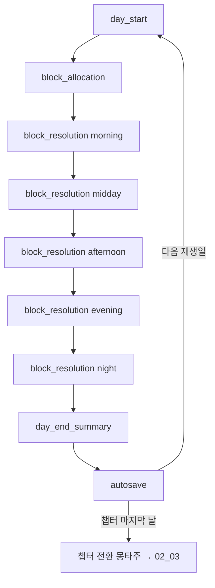

# 02_01 Core Loop

하루(1일 = 1세션, 20~40분, D-006)를 구성하는 루프의 단일 명세. 하루는 5개 시간 블록(time_block, D-007)으로 나뉘며, 루프 단계(loop_phase)는 `day_start → block_allocation → block_resolution ×5 → day_end_summary → autosave` 순서로 고정된다. 게임오버는 없다(D-002).

## 1. 루프 개요

## 2. 단계별 명세

### 2.1 day_start (하루 시작)

| 구분 | 내용 |
|---|---|
| 입력 | 직전 autosave 데이터, `day_id`(02_03), `day_type`(weekday/weekend), 전날 night 블록 결과 |
| 처리 | ① 자원 갱신(아래 표) ② `on_day_start` 이벤트 윈도우 판정(scheduled 우선) ③ 오늘의 블록 보드 생성(챕터 해금·잠금 반영) |
| 출력 | 갱신된 핵심 수치 5종, 잠금 블록 목록(`locked_by_event`), 아침 브리핑 연출 |

자원 갱신식(값은 밸런싱 기준값, 03_GAME_SYSTEM에서 튜닝):

| 수치 | 갱신식 | 비고 |
|---|---|---|
| stamina(엄마 체력) | `min(100, stamina + 25 + night_rest_bonus)` | `night_rest_bonus`: 전날 night가 방해 없는 취침이면 +15, 야간 이벤트(수유 등) 발생 시 0 |
| mind(엄마 마음) | `min(100, mind + 5 + weekend_bonus)` | `weekend_bonus`: `day_type == weekend`이면 +5 |
| child_condition(아이 컨디션) | `min(100, child_condition + 10)` | 수면 회복. 질병 상태 이벤트 중이면 회복 없음 |
| attachment(애착도) | 변화 없음 | 행동·이벤트로만 변화 |
| money(가계) | 변화 없음 | 수입·지출은 block_resolution / day_end_summary에서 처리 |

### 2.2 block_allocation (일과 배분)

| 구분 | 내용 |
|---|---|
| 입력 | 5개 블록 보드, 챕터별 해금 행동 목록(02_03), 현재 stamina |
| 처리 | 플레이어가 잠금되지 않은 블록마다 행동 카테고리(care/housework/work/selfcare/outing) 1개를 배분. 블록당 정확히 1개(02_02 규칙). 예상 stamina가 0 미만이면 경고 표시(배분 자체는 허용 — 실패 없음) |
| 출력 | `day_plan` = `{time_block: action_id}` 5쌍. 미배분 블록은 기본 행동 자동 배정(night → `act_selfcare_sleep`, 그 외 → `act_care_watch`) |

### 2.3 block_resolution ×5 (블록 해소)

morning → midday → afternoon → evening → night 순서로 5회 반복. 블록 1회의 내부 순서:

1. `on_block_start` 이벤트 윈도우 판정 — scheduled·random 트리거. 이벤트가 블록을 점유하면 배분된 행동은 취소되고 이벤트로 대체(`locked_by_event`)
2. 행동 실행 — `day_plan`의 action 비용·효과 적용(02_02 표). work 수입은 이 시점에 money에 가산
3. `on_block_end` 이벤트 윈도우 판정 — conditional 트리거(수치·memory_log 조건)
4. `block_log` 기록(02_02 Database) 및 선택 발생 시 `memory_log` 엔트리 추가

### 2.4 day_end_summary (하루 마감 요약)

| 구분 | 내용 |
|---|---|
| 입력 | 당일 `block_log` 5건, 당일 수치 변화 누계, 발생 이벤트·선택 목록 |
| 처리 | ① `on_day_end` 이벤트 윈도우 판정(conditional만) ② 생활비 차감: weekday `money -= 30000`, weekend `money -= 40000` ③ 변화 요약 화면 구성 |
| 출력 | 요약 화면(시스템 화면이므로 수치 표기 허용 — D-004는 감정 장면 한정), 오늘의 기억(당일 memory_tag 1개 하이라이트) |

### 2.5 autosave (자동 저장)

| 구분 | 내용 |
|---|---|
| 입력 | 전체 게임 상태(핵심 수치 5종, 성격 축 4종, memory_log, day_id, 챕터 상태) |
| 처리 | 슬롯 `autosave_slot`에 단일 덮어쓰기 저장. 저장 실패 시 1회 재시도 후 오류 안내(진행은 유지) |
| 출력 | 저장 완료 아이콘 → 다음 재생일 day_start로, 챕터 마지막 날이면 전환 몽타주(02_03)로 이행 |

## 3. 이벤트 발생 윈도우 (D-010 연동)

| 윈도우(`event_window`) | 시점 | 허용 트리거 | 상한 |
|---|---|---|---|
| `on_day_start` | day_start 처리 ② | scheduled | 1건/일 |
| `on_block_start` | 각 블록 행동 실행 전 | scheduled, random | 블록당 1건 |
| `on_block_end` | 각 블록 행동 실행 후 | conditional | 블록당 1건 |
| `on_day_end` | day_end_summary 처리 ① | conditional | 1건/일 |

- 동일 윈도우에서 복수 이벤트가 조건을 만족하면 `priority` 내림차순 → `event_id` 오름차순으로 1건만 발생.
- 하루 총 발생 상한: scheduled 제외 3건. 초과분은 다음 재생일로 이월 판정.
- 모든 이벤트는 `emotion_tags` 필수(D-005), 감정 장면 중 수치 UI 숨김(D-004).

## 4. 주간 리듬 (weekday / weekend)

재생일마다 `day_type`이 지정된다(02_03의 day 정의에 포함). 차이는 다음과 같다.

| 항목 | weekday(평일) | weekend(주말) |
|---|---|---|
| work(일) 행동 | 해금 챕터에서 가능(midday/afternoon 한정) | 불가 |
| outing(외출) 효과 | 기본값 | attachment +2, mind +2 추가 보정 |
| day_start 보정 | 없음 | mind +5 (`weekend_bonus`) |
| 생활비(day_end) | -30,000원 | -40,000원 (외식·나들이 반영) |
| 이벤트 풀 | 기관·직장 계열(어린이집, 복직 등) | 가족·나들이 계열 |

## 5. 챕터 루프와의 관계

- 챕터는 모든 날짜가 아니라 대표 재생일 12~20일을 압축 샘플링한다(02_03). 코어 루프는 재생일 1일 단위로만 돌며, 재생일 사이의 시간 경과는 몽타주 자막으로 처리한다.
- 챕터 마지막 재생일의 autosave가 끝나면 챕터 전환 몽타주 → 다음 챕터 첫 day_start로 이어진다. 챕터 진입·종료 조건과 해금 표는 02_03이 소유한다.
- 루프 자체는 5개 챕터에서 동일하며, 챕터는 (a) 해금 행동 (b) 이벤트 풀 (c) night 블록 특수 규칙(예: CH1 야간 수유, 02_02)만 교체한다.
