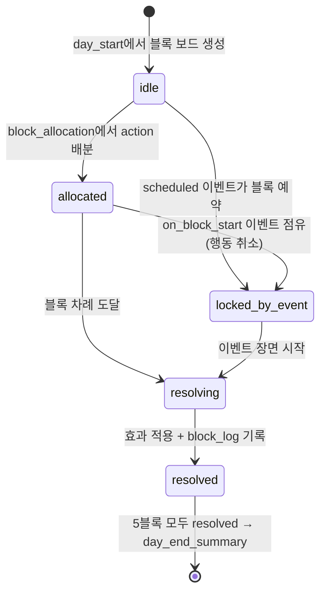

# 02_02 Time Block System

## Purpose

하루를 5개 시간 블록(time_block)으로 분할해(D-007) "자원은 항상 부족하다"(Pillar 2)를 구현한다. 플레이어는 블록당 행동 1개만 배분할 수 있어 돌봄·가사·일·자기돌봄·외출 사이의 포기를 매일 강제당한다. 블록은 코어 루프(02_01)의 block_allocation / block_resolution 단계에서 소비된다.

## Variables

| 변수 | 타입 | 값/범위 | 정의 |
|---|---|---|---|
| `time_block` | enum | `morning`, `midday`, `afternoon`, `evening`, `night` | 아침/낮/오후/저녁/밤 (D-007) |
| `action_category` | enum | `care`, `housework`, `work`, `selfcare`, `outing` | 돌봄/가사/일/자기돌봄/외출 |
| `action_id` | string | `act_{category}_{name}` | 행동 식별자. 예: `act_care_feeding` |
| `block_state` | enum | `idle`, `allocated`, `locked_by_event`, `resolving`, `resolved` | 블록 생명주기 |
| `day_plan` | map | `{time_block: action_id}` ×5 | block_allocation의 산출물 |
| `night_rest_bonus` | int | 0 또는 15 | night 취침이 방해 없이 끝나면 다음 day_start에 stamina +15 (02_01) |
| `base_cost` / `base_effect` | int | 아래 표 | 카테고리 기본 비용·효과. 개별 action이 ±50% 범위에서 오버라이드 |

카테고리별 기본 비용·효과(1블록 기준, 밸런싱 기준값):

| category | stamina | money(원) | attachment | child_condition | mind | 허용 블록 |
|---|---|---|---|---|---|---|
| care(돌봄) | -15 | -10,000 | +4 | +6 | 0 | 전 블록 |
| housework(가사) | -10 | -5,000 | 0 | +2 | -2 | night 제외 |
| work(일) | -20 | +80,000 | -2 | 0 | -3 | midday, afternoon (weekday, CH2 복직 후) |
| selfcare(자기돌봄) | +15 | -5,000 | -1 | 0 | +8 | 전 블록 (`act_selfcare_sleep`은 night 전용, 비용 0원) |
| outing(외출) | -20 | -30,000 | +6 | +4 | +5 | midday, afternoon (weekend는 morning 추가) |

블록당 배분 규칙:

1. 잠금되지 않은 블록에는 정확히 1개 action만 배분한다. 0개·2개 불가.
2. 미배분 블록은 자동 배정: night → `act_selfcare_sleep`(취침), 그 외 → `act_care_watch`(지켜보기, 효과 attachment +1만).
3. stamina가 0이어도 배분은 가능하다(실패 없음, D-002). 단 stamina 0 상태의 행동은 효과 절반(내림) + mind -5 페널티.
4. mind < 20이면 selfcare 외 카테고리에 "지친 손길" 보정: attachment 효과 절반(내림). 선택지 제한은 04_PLAYER 소유.

night 블록 특수 규칙:

- night 허용 카테고리는 care와 selfcare뿐. 기본은 취침(`act_selfcare_sleep`, stamina +15·mind +3, `night_rest_bonus` 성립).
- CH1: 매 재생일 night에 야간 수유 scheduled 이벤트(`ch1_ev_night_feeding`)가 `on_block_start` 윈도우에서 강제 발생해 블록을 점유한다(`locked_by_event`). 효과: stamina -10, attachment +2, `night_rest_bonus` = 0. `emotion_tags`: `["overwhelmed","wonder"]`.
- CH2 이후: 야간 이벤트는 conditional/random으로만 발생(빈도 CH2 주 2회 → CH5 0회 수준으로 감쇠).

## State Machine



전이 조건: `resolving → resolved`는 (a) 행동 효과 적용 완료 (b) `on_block_end` conditional 판정 완료 (c) `block_log` 기록 성공을 모두 만족해야 한다.

## UI

- 화면 하단에 블록 바 5칸(아침~밤)을 상시 표시. 각 칸에 카테고리 아이콘 + 행동명. `locked_by_event` 칸은 자물쇠 아이콘과 이벤트 예고 실루엣만 표시.
- block_allocation 중에는 stamina 예상 잔량을 게이지(수치 없음)로 표시. 예상 잔량 0 미만이면 게이지 점멸 경고.
- 이벤트 감정 장면 진입 시 블록 바·게이지 포함 모든 수치 UI 숨김(D-004). 장면 종료 후 복귀.
- 효과 수치는 팝업 숫자 대신 연출로 전달(아이 표정, 엄마 한숨 등). day_end_summary에서만 수치 변화 표기 허용.

## Database

`action_def` (행동 정의, 정적 데이터):

| 컬럼 | 타입 | 설명 |
|---|---|---|
| action_id | TEXT PK | `act_{category}_{name}` |
| category | TEXT | action_category enum |
| allowed_blocks | TEXT | time_block 목록(콤마 구분) |
| unlock_chapter | INT | 해금 챕터(02_03 표와 동기화) |
| cost_effect_json | TEXT | 비용·효과 JSON(아래 스키마) |

`block_log` (블록 해소 기록, 일별 5행):

| 컬럼 | 타입 | 설명 |
|---|---|---|
| day | INT | 재생일 인덱스 |
| time_block | TEXT | 블록 |
| action_id | TEXT FK | 실행 행동(이벤트 점유 시 NULL) |
| event_id | TEXT | 발생 이벤트(없으면 NULL) |
| effects_json | TEXT | 실제 적용된 수치 변화 |

## JSON

```json
{
  "action_id": "act_care_feeding",
  "category": "care",
  "name_kr": "이유식 먹이기",
  "allowed_blocks": ["morning", "midday", "evening"],
  "unlock_chapter": 1,
  "costs": {"stamina": -15, "money": -10000},
  "effects": {"attachment": 4, "child_condition": 8, "mind": 0},
  "overrides_base": true
}
```

## QA

| TC | 시나리오 | 기대 결과 |
|---|---|---|
| TB-01 | 블록 1개에 행동 2개 배분 시도 | 두 번째 배분이 첫 배분을 교체(중복 저장 없음) |
| TB-02 | night에 housework/work/outing 배분 시도 | 배분 불가, 허용 카테고리만 노출 |
| TB-03 | CH1 임의 재생일 night 진행 | `ch1_ev_night_feeding` 강제 발생, `night_rest_bonus`=0, 다음 day_start stamina 회복 +25만 적용 |
| TB-04 | 미배분 상태로 block_resolution 진입 | night는 `act_selfcare_sleep`, 그 외는 `act_care_watch` 자동 배정 |
| TB-05 | stamina 0에서 care 실행 | 효과 절반(내림) + mind -5, 실행 자체는 성공(게임오버 없음) |
| TB-06 | weekday에 outing을 morning에 배분 | 불가(주말 전용 블록). weekend에는 가능 |
| TB-07 | 감정 장면 중 UI 캡처 | 블록 바·게이지 등 수치 UI 미표시(D-004) |
| TB-08 | 5블록 resolved 후 block_log 조회 | 당일 정확히 5행, effects_json이 실제 적용값과 일치 |
