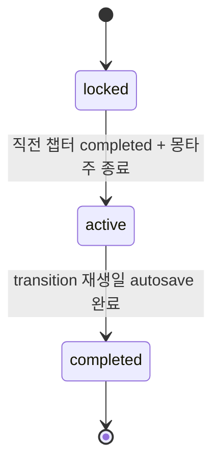

# 02_03 Chapter Structure

0세~만 7세를 5개 챕터로 나누고(D-001), 챕터마다 대표 재생일 12~20일만 압축 샘플링해 플레이한다. 모든 날을 플레이하지 않으며, 재생일 사이의 시간 경과는 몽타주로 처리한다. 코어 루프는 02_01, 감정 목표는 01_04를 따른다.

## 1. 압축 샘플링 방식

- 재생일 식별자: `day_id` = `ch{챕터}_day_{순번2자리}` (예: `ch1_day_03`).
- 재생일 종류(`day_kind`):

| day_kind | 정의 | 이벤트 구성 |
|---|---|---|
| `milestone` | 서사 고정일(첫 외출, 돌잔치, 입소 첫날 등) | scheduled 이벤트 1건 이상 필수 |
| `routine` | 일상 반영일. 누적 수치·기억이 드러나는 날 | conditional/random 중심 |
| `transition` | 챕터 마지막 재생일 | 챕터 마무리 scheduled + 전환 몽타주 진입 |

- 각 재생일은 `day_type`(weekday/weekend)과 게임 내 시점 자막(`date_label_kr`, 예: "생후 100일")을 갖는다.
- 샘플링 규칙: milestone은 챕터 서사에서 고정, routine은 milestone 사이에 2~3일 간격으로 배치, transition은 항상 1일. 재생일 사이 건너뛴 기간은 다음 day_start 전에 "3주 후" 형식 자막으로 명시한다.

## 2. 챕터별 재생 일수 설계

| 챕터 | 시기 | 재생일 수 | milestone | routine | transition | 대표 milestone 예시 |
|---|---|---|---|---|---|---|
| CH1 | 0~12개월 | 16 | 7 | 8 | 1 | 조리원 퇴소, 예방접종, 100일, 첫 뒤집기, 돌잔치 |
| CH2 | 1~3세 | 18 | 8 | 9 | 1 | 첫 걸음, 복직 결정, 어린이집 입소 대기·입소 첫날 |
| CH3 | 3~5세 | 16 | 7 | 8 | 1 | 유치원 발표회, 친구 갈등, 맘카페 비교 |
| CH4 | 5~6세 | 14 | 6 | 7 | 1 | 크게 혼낸 날, 화해, 아이의 비밀 |
| CH5 | 6~7세 | 12 | 6 | 5 | 1 | 입학 준비물, 예비소집일, 입학식(엔딩 → 02_04) |

- 합계 76 재생일. 재생일 평균 체감 5~8분(milestone 10~15분, routine 3~5분)이며 1세션(20~40분)에 재생일 3~5일을 진행한다(D-016) — 총 플레이 약 7~10시간으로 01_03 목표와 정합.
- routine 일수는 QA 밸런싱에 따라 챕터당 ±2일 조정 가능(12~20일 범위 유지). milestone·transition은 고정.

## 3. 챕터 전환 연출 (시간 경과 몽타주)

- 식별자: `montage_id` = `mt_ch{n}_to_ch{n+1}` (예: `mt_ch1_to_ch2`). CH5 종료는 몽타주 대신 엔딩 시퀀스(02_04).
- 구성(총 60~90초, 스킵 불가 — 단 2회차부터 스킵 허용):

| 순서 | 단계 | 내용 |
|---|---|---|
| 1 | fade_out | 마지막 재생일 autosave 완료 후 암전 |
| 2 | photo_album | 해당 챕터 memory_log에서 `emotion_tags`가 챕터 목표와 일치하는 상위 3건을 사진 스틸로 재생 |
| 3 | caption | 경과 자막(예: "그렇게 겨울이 두 번 지났다") + 아이 나이 표기 |
| 4 | wake_up | 다음 챕터 첫 재생일 day_start로 연결. 신규 해금 안내는 여기서 1회만 표시 |

- 몽타주 중 수치 UI 전면 숨김(D-004). 몽타주 자체는 이벤트가 아니므로 `emotion_tags` 의무 대상이 아니지만, photo_album 선정 로직이 태그를 사용한다.

## 4. 챕터별 신규 시스템·행동 해금

| 챕터 | 신규 시스템 | 해금 행동(action, 02_02) | 잠금 해제 조건 |
|---|---|---|---|
| CH1 | 기본 루프, 야간 수유 강제 이벤트, memory_log | care 전종, housework, selfcare. outing은 `act_outing_walk`(짧은 산책)만 | 게임 시작 시 |
| CH2 | work 시스템(복직), 어린이집(등원/하원), 야간 이벤트 감쇠 | `act_work_office`, outing 전종, `act_care_daycare_dropoff` | CH2 진입 + 복직 결정 milestone(`ch2_day_05`) 완료 |
| CH3 | 유치원, 아이 대화 선택(성격 축 반영 강화), 비교 이벤트 풀 | `act_care_kindergarten_prep`, `act_outing_playdate` | CH3 진입 시 |
| CH4 | 갈등·화해 이벤트 체인, 아이 단독 행동 연출 | `act_care_deep_talk`(마음 대화) | CH4 진입 시 |
| CH5 | 입학 준비, 기억 회상 이벤트(memory_log 재생) | `act_care_school_prep`, `act_outing_school_visit` | CH5 진입 시 |

- 해금은 챕터 단위가 원칙이며, 예외적으로 milestone 완료를 조건으로 걸 수 있다(위 표의 CH2 work).
- 해금 정보는 `action_def.unlock_chapter`(02_02 Database)와 반드시 동기화한다.

## 5. 챕터 진입·종료 조건

- 챕터 상태: `chapter_state` = `locked` | `active` | `completed`.

| 구분 | 조건 |
|---|---|
| 진입(→ active) | 직전 챕터 `completed` + 전환 몽타주 재생 완료. CH1은 게임 시작 시 자동 active |
| 종료(→ completed) | 해당 챕터의 모든 milestone·transition 재생일의 autosave 완료. routine 일은 진행 순서상 자동 포함 |
| 수치 게이트 | 없음. 어떤 수치 상태여도 챕터는 진행된다(D-002). 수치·기억은 이벤트 내용과 엔딩(02_04)에만 반영 |

- 재생일 진행은 `day_id` 순번 오름차순으로 선형 진행하며 되돌아가기·건너뛰기는 없다.
- CH5의 transition 재생일(`ch5_day_12`, 입학식)은 몽타주 대신 엔딩 시퀀스로 직결된다(02_04).
- 챕터별 재생일 목록·자막·milestone 상세는 07_EVENT의 챕터 문서가 소유하고, 본 문서는 구조와 수량 규칙만 관리한다.

## 6. 다른 문서와의 계약

| 항목 | 소유 문서 | 본 문서가 강제하는 것 |
|---|---|---|
| 재생일별 이벤트 내용 | 07_EVENT | `day_kind`별 트리거 구성 규칙, 재생일 수 12~20 |
| 행동 해금 데이터 | 02_02 (`action_def.unlock_chapter`) | 4절 해금 표와의 동기화 |
| 감정 목표 태깅 | 01_04, 07_EVENT | 몽타주 photo_album의 챕터 목표 태그 일치 선정 |
| 엔딩 진입 | 02_04 | `ch5_day_12` 종료 시 엔딩 시퀀스 호출 |
