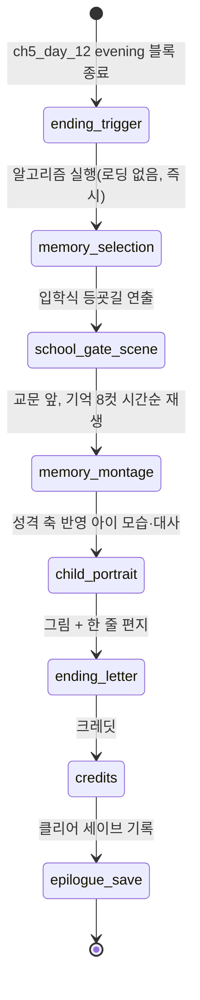

# 02_04 Ending System

> **범위 재정의 (D-029)**: 본 문서의 입학식 엔딩은 게임 전체의 최종 엔딩이 아니라 **1막(유년기) 피날레**다. 기억 선정·편지 시스템은 막 피날레의 공통 장치로 재사용되며, 일생의 끝에서 재생되는 최종 엔딩은 종막 설계(5차 큐)에서 정의한다.

## Purpose

CH5 마지막 재생일(입학식, `ch5_day_12`)에서 7년의 플레이를 회수한다. 엔딩은 분기 등급이 아니라 (a) memory_log에서 선정한 기억 몽타주 (b) 성격 축 4종(D-008)이 만든 아이의 모습 (c) 아이가 그린 그림 한 장 + 한 줄 편지로 구성된다. "선택은 쌓여서 사람이 된다"(Pillar 4)의 최종 구현체이며, 좋은/나쁜 엔딩 판정은 존재하지 않는다(D-002).

## Variables

| 변수 | 타입 | 값/범위 | 정의 |
|---|---|---|---|
| `ending_id` | string | `ending_entrance_day` 고정 | 엔딩 시퀀스 식별자(v1은 1종) |
| `memory_pick_count` | int | 8 | 몽타주로 회수하는 기억 수 |
| `memory_score` | int | 계산값 | 기억 선정 점수(아래 알고리즘) |
| `tag_novelty` | int | 0~n | 해당 기억이 새로 추가하는 미회수 emotion_tags 수 |
| `personality_band` | enum | `low`(0~39), `mid`(40~69), `high`(70~100) | 성격 축 구간. 4축 공통 |
| `dominant_axis` | string | confidence/empathy/independence/expressiveness | 최종값 최대 축(동률 시 confidence→empathy→independence→expressiveness 우선) |
| `attachment_band` | enum | `low`(<40), `mid`(40~69), `high`(≥70) | 편지 어조 결정 |
| `drawing_id` | string | `draw_{테마}` | 엔딩 그림 식별자 |
| `letter_line_id` | string | `letter_{axis}_{band}` | 편지 한 줄 템플릿 식별자 |

기억 선정 알고리즘(결정적, 난수 없음):

1. 후보 풀 = memory_log 전체 중 `memory_tag`가 있는 엔트리.
2. 점수식: `memory_score = priority(원본 이벤트) × 2 + tag_novelty × 3 + |effects.attachment|`. 동점이면 `day`가 이른 쪽 우선.
3. 챕터 커버리지: CH1~CH5 각각에서 최고점 1건씩 먼저 확정(5건). 해당 챕터에 후보가 없으면 그 슬롯은 6단계 전체 풀 선발로 대체.
4. 확정된 기억의 emotion_tags를 "회수됨"으로 표시하고 잔여 후보의 `tag_novelty`를 재계산.
5. 감정 다양성: 잔여 3건은 재계산 점수 내림차순 그리디 선발. 단 동일 emotion_tag가 선정 집합에서 3회를 넘지 않고, 동일 챕터가 총 3건을 넘지 않도록 제외 규칙 적용.
6. 총 후보가 8건 미만이면 있는 만큼만 사용(최소 1건 보장 — CH1 야간 수유가 memory_tag를 남기므로 0건 불가).
7. 재생 순서는 `day` 오름차순(시간순 몽타주).

## State Machine



전이는 모두 자동이며 입력 대기는 `ending_letter`(편지를 넘기는 1회 탭)에만 존재한다. `ending_trigger` 진입 시 night 블록과 day_end_summary는 생략된다.

## UI

- 엔딩 전 구간은 감정 장면으로 취급, 수치 UI 전면 숨김(D-004). 성격 축·수치는 끝까지 숫자로 노출하지 않는다.
- memory_montage: 기억 1건 = 스틸 1컷 + `date_label_kr` 자막 + 당시 선택 대사 1줄. 컷당 6초, BGM은 11_SOUND 엔딩 모티프.
- child_portrait: 아이 전신 일러스트 1종 + 대사 1~2줄. 표정·자세·대사는 아래 매핑 표로 조립(축별 밴드 조합).
- ending_letter: 스케치북 연출. 그림이 먼저 그려지는 애니메이션 후 한 줄 텍스트 표기. 이후 크레딧.

성격 축 구간 → 아이 모습·대사 매핑(각 축은 독립 적용, 대사는 `dominant_axis`의 밴드 것만 출력):

| 축 | low(0~39) | mid(40~69) | high(70~100) |
|---|---|---|---|
| confidence(자신감) | 엄마 뒤에 반쯤 숨음 / "…같이 가면 안 돼?" | 손을 잡았다 놓았다 함 / "나 잘할 수 있겠지?" | 교문을 먼저 가리킴 / "엄마, 나 먼저 가볼게!" |
| empathy(공감) | 또래를 물끄러미 봄 / "쟤는 왜 울어?" | 우는 아이 옆을 서성임 / "쟤 괜찮을까?" | 우는 아이에게 다가감 / "내가 손 잡아줄게" |
| independence(자립심) | 가방을 엄마에게 맡김 / "엄마가 들어줘" | 가방끈을 스스로 고쳐 멤 / "이거 내가 멜게" | 실내화 주머니까지 챙김 / "준비물 내가 다 확인했어" |
| expressiveness(표현력) | 고개만 끄덕임 / (말 없이 손만 흔든다) | 짧게 또박또박 / "학교 다녀오겠습니다" | 크게 손을 흔들며 / "엄마! 이따 오늘 얘기 다 해줄게!" |

## Database

`ending_result` (클리어 세이브, 1행):

| 컬럼 | 타입 | 설명 |
|---|---|---|
| ending_id | TEXT PK | `ending_entrance_day` |
| picked_memories_json | TEXT | 선정 기억 8건(day, event_id, choice_id, memory_tag) |
| personality_bands_json | TEXT | 4축 최종값·밴드 |
| dominant_axis | TEXT | 최대 축 |
| attachment_final | INT | 엔딩 시점 attachment |
| drawing_id / letter_line_id | TEXT | 편지 구성 요소 |
| cleared_at | TEXT | ISO8601 클리어 시각 |

## JSON

엔딩 편지 생성 규칙: `drawing_id`는 선정 기억 8건의 emotion_tags 최빈 태그(동률 시 후순위 챕터 태그 우선)를 테마로 매핑 — `wonder/joy → draw_family_sunny`(가족 그림·해), `burnout/overwhelmed/isolation → draw_holding_hands`(손잡은 두 사람), `pride/reward/fulfillment → draw_school_gate`(학교와 꽃), `guilt/reconciliation/worry/comparison → draw_umbrella`(한 우산 속 두 사람), `letting_go/loss → draw_waving_child`(손 흔드는 아이). 한 줄은 `letter_{axis}_{band}` 템플릿(axis = 대표 축, band = 해당 축의 구간. 총 12종, 정본은 08_05). attachment 밴드는 편지 장면의 연출 온도(카메라 거리·음악 강도)에만 사용하고 템플릿 선정에는 쓰지 않는다.

```json
{
  "ending_id": "ending_entrance_day",
  "picked_memories": [
    {"day": 3, "event_id": "ch1_ev_001", "choice_id": "ch1_ev_001_c2", "memory_tag": "first_bath", "emotion_tags": ["overwhelmed", "wonder"]}
  ],
  "personality_bands": {
    "confidence": {"value": 72, "band": "high"},
    "empathy": {"value": 55, "band": "mid"},
    "independence": {"value": 61, "band": "mid"},
    "expressiveness": {"value": 44, "band": "mid"}
  },
  "dominant_axis": "confidence",
  "attachment_final": 76,
  "drawing_id": "draw_school_gate",
  "letter_line_id": "letter_confidence_high",
  "letter_text_kr": "내일은 내가 먼저 갈께"
}
```

## QA

| TC | 시나리오 | 기대 결과 |
|---|---|---|
| ED-01 | memory_log 40건, 전 챕터 분포 | 정확히 8건 선정, 챕터당 최소 1건·최대 3건, 동일 태그 3회 이하 |
| ED-02 | CH3 기억이 0건인 세이브 | CH3 슬롯이 전체 풀 선발로 대체되고 총 8건 유지 |
| ED-03 | 후보 총 6건뿐인 세이브 | 6건만으로 몽타주 재생, 오류 없음 |
| ED-04 | 4축 전부 50(변화 없음 플레이) | 전 축 `mid`, dominant_axis=confidence(우선순위 규칙), 대응 대사 출력 |
| ED-05 | 동일 세이브로 2회 클리어 | 알고리즘이 결정적이므로 선정 기억·그림·편지가 완전히 동일 |
| ED-06 | attachment 35로 엔딩 진입 | `attachment_band`=low 편지 출력, 실패·배드엔딩 표기 없음(D-002) |
| ED-07 | 엔딩 전 구간 UI 검사 | 수치·게이지 미노출(D-004), 성격 축 숫자 미노출 |
| ED-08 | ending_result 저장 후 재실행 | 클리어 세이브 1행 존재, picked_memories_json이 몽타주와 일치 |
