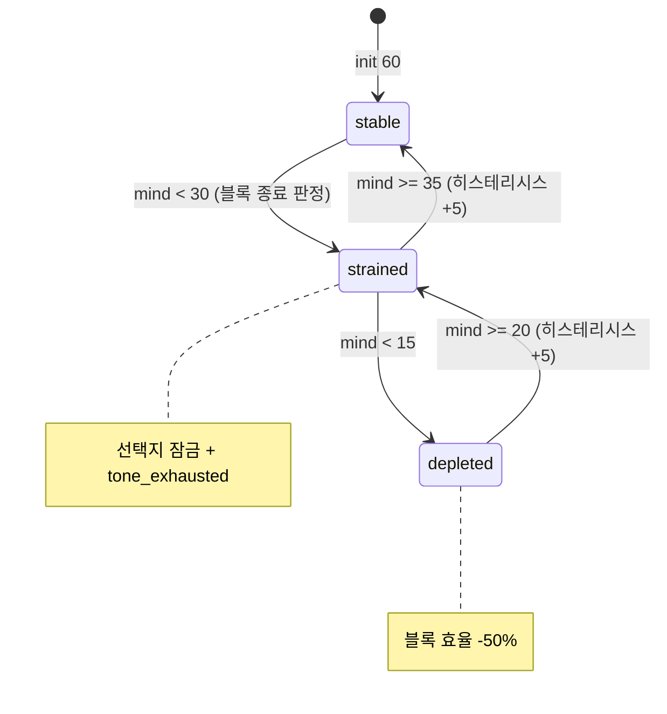

# 03_01 Stat System

## Purpose

핵심 수치 5종과 아이 성격 축 4종의 변화 규칙을 단일 기준으로 정의한다. 모든 수치는 감정 전달의 수단이며(Pillar 1), 감정 장면에서는 UI에 노출하지 않는다(D-004). 게임오버는 없고(D-002), 수치는 서사적 결과(이벤트 트리거·선택지 잠금·연출 변화)로만 되돌아온다. 다른 문서(04_PLAYER, 05_CHILD, 07_EVENT)는 본 문서의 식과 표를 참조만 하고 재정의하지 않는다.

## Variables

### 핵심 수치 5종 (D-003, 초기값 D-009)

| 식별자 | 한국어 | 범위 | init | 일일 자연 변화 (day_end_summary 시 적용) |
|---|---|---|---|---|
| `attachment` | 애착도 | 0~100 | 50 | 당일 아이 상호작용 블록 0회 → −2. 1회 이상 → 0 (증가는 선택지 `effects`로만) |
| `child_condition` | 아이 컨디션 | 0~100 | 70 | `−4 + meal_score + sleep_score` (아래 표) |
| `stamina` | 엄마 체력 | 0~100 | 70 | night 블록 수면 질에 따라 회복 (아래 표) |
| `mind` | 엄마 마음 | 0~100 | 60 | `stamina < 30`이면 −3, 자기 돌봄 블록 1회 이상이면 +2 (중복 적용 가능) |
| `money` | 가계 | 정수(원) ≥ 0 | 3,000,000 | 일일 자연 변화 없음. 03_02의 정산 규칙만 적용 |

### 아이 성격 축 4종 (D-008)

| 식별자 | 한국어 | 범위 | init | 변화 규칙 |
|---|---|---|---|---|
| `confidence` | 자신감 | 0~100 | 50 | 선택지 `effects` 누적으로만 변화. 자연 변화·감쇠 없음 |
| `empathy` | 공감 | 0~100 | 50 | 동일 |
| `independence` | 자립심 | 0~100 | 50 | 동일 |
| `expressiveness` | 표현력 | 0~100 | 50 | 동일. 단일 선택의 절대값 상한 ±3 (단일 분기 금지, Pillar 4) |

### 일일 자연 변화 세부 계수

| 계수 | 조건 | 값 |
|---|---|---|
| `sleep_score` → stamina 회복 | night 블록 통잠 (수면 방해 이벤트 없음) | +25 |
| | night 블록에 아이 깨움 이벤트 1회 | +15 |
| | night 블록에 아이 깨움 이벤트 2회 이상 | +8 |
| | night 블록을 다른 행동에 사용 (밤샘) | +0 |
| `sleep_score` → child_condition | 아이 통잠 성공 | +4 / 실패 +1 |
| `meal_score` → child_condition | 당일 식사(수유) 블록 2회 이상 | +3 / 1회 +1 / 0회 +0 |

### 임계값 효과 표

| 조건 | 효과 | 소관 문서 |
|---|---|---|
| `mind < 30` | `requires.mind_min: 30` 선택지 잠금, 엄마 대사 톤 `tone_exhausted`로 전환 | 08_DIALOGUE |
| `mind < 15` | 자기 돌봄 외 블록 효율 −50% (effects 절반, 내림) | 02_GAME_DESIGN |
| `stamina < 20` | afternoon·evening 블록에서 행동 선택지 1개 자동 비활성 | 02_GAME_DESIGN |
| `child_condition < 40` | conditional 이벤트 `ch*_ev_hospital_*` 트리거 조건 충족 | 07_EVENT |
| `child_condition < 20` | 병원 이벤트 priority 최상위(100) 강제 발생 | 07_EVENT |
| `attachment < 30` | 아이 행동 연출 `distant` 세트로 교체 (낯가림·회피) | 05_CHILD, 10_ART |
| `attachment ≥ 70` | 아이 행동 연출 `secure` 세트 (먼저 안기기) | 05_CHILD, 10_ART |
| `money < 300,000` | 지출 필요 선택지에 `text_kr` 변형(망설임 문구) 노출 | 03_02, 08_DIALOGUE |

### 클램프·반올림 규칙

1. 모든 변동은 적용 순서대로 합산 후 마지막에 1회 클램프: `clamp(value, 0, 100)` (money는 `max(value, 0)`).
2. 비율 연산(예: 효율 −50%)은 소수점 발생 시 **0에서 먼 쪽이 아닌 내림(floor)** 처리. 예: −3의 50% → −1.
3. 동일 블록 내 복수 effects는 등록 순서대로 적용하되, 임계값 판정은 블록 종료 시점 값으로 1회만 수행.
4. 일일 자연 변화는 `day_end_summary` 단계에서 선택 효과보다 **나중에** 적용한다.

## State Machine

수치 자체는 상태가 없고, 임계 구간(band)이 파생 상태를 만든다. 대표로 `mind`의 밴드 전이를 정의한다. 나머지 수치도 동일 패턴(경계값만 상이)을 따른다.



- 밴드 전이 판정 시점: 각 `block_resolution` 종료 시 1회, `day_end_summary`에서 1회.
- 히스테리시스 +5: 경계값 근처 진동으로 연출이 깜빡이는 것을 방지.

## UI

- 평시(블록 배분 화면): 5종 수치를 아이콘+게이지로 표시. money만 숫자(원화 콤마 표기) 노출.
- 감정 장면(이벤트 scenes 재생 중): 모든 수치 UI 숨김(D-004). 변화량은 연출로만 표현.
- `day_end_summary`: 당일 변화량을 화살표(▲▼)로 표시하되 성격 축 4종은 숫자를 절대 노출하지 않고 문장형 코멘트로만 표기(예: "아이가 오늘 낯선 사람에게 먼저 인사했다").
- 밴드 전이 발생 시 토스트 없이 배경·엄마 포즈 변화로만 알린다(09_UI 연동).

## Database

| 테이블 | 키 | 컬럼 | 비고 |
|---|---|---|---|
| `player_state` | save_id | attachment, stamina, mind, money, updated_day | 12_DATABASE 스키마 소유 |
| `child_state` | save_id | child_condition, confidence, empathy, independence, expressiveness | 성격 축 포함 |
| `stat_delta_log` | save_id, day, seq | stat_key, delta, source(`choice`/`daily`/`settlement`), ref_id | QA 리플레이·밸런싱용 |
| `stat_threshold_def` | stat_key, band | min, max, hysteresis, effect_id | 임계값 표의 데이터화 (Pillar 3: 상수는 DB 관리) |

## JSON

선택지 효과와 일일 자연 변화의 직렬화 예시. 이벤트 골격은 07_EVENT 공용 스키마를 따른다.

```json
{
  "event_id": "ch1_ev_014",
  "chapter": 1,
  "title_kr": "새벽 세 번째 깨어남",
  "emotion_tags": ["overwhelmed"],
  "trigger": {"type": "conditional", "conditions": [{"stat": "stamina", "op": "lt", "value": 30}]},
  "priority": 10,
  "scenes": [],
  "choices": [
    {
      "choice_id": "ch1_ev_014_c1",
      "text_kr": "그래도 일어나서 아이를 안는다",
      "requires": {"mind_min": 30},
      "effects": {"attachment": 3, "stamina": -8, "mind": -2},
      "memory_tag": "mem_ch1_night_holding"
    }
  ],
  "once": false,
  "cooldown_days": 3
}
```

```json
{
  "daily_rules": {
    "attachment": {"no_interaction_decay": -2},
    "mind": {"low_stamina_penalty": {"if": "stamina<30", "delta": -3}, "self_care_bonus": 2},
    "clamp": {"min": 0, "max": 100}
  }
}
```

## QA

| TC | 사전 조건 | 절차 | 기대 결과 |
|---|---|---|---|
| ST-01 | attachment 50, 아이 상호작용 블록 0회 | 하루 종료 | attachment 48 (−2) |
| ST-02 | stamina 96, 통잠 성공 | 하루 종료 | stamina 100 (=clamp(96+25)) |
| ST-03 | mind 31 | 블록 중 effects −2 | 블록 종료 시 strained 진입, `mind_min:30` 선택지 잠금 |
| ST-04 | mind 33 (strained 상태) | +1 회복 | 34 → strained 유지 (히스테리시스 35 미달) |
| ST-05 | child_condition 41 | 식사 0회·수면 실패로 39 도달 | 병원 conditional 트리거 조건 활성, 게임오버 미발생 확인 |
| ST-06 | 단일 선택지에 성격 축 effects +4 정의 | 콘텐츠 린트 실행 | 상한 ±3 위반으로 리젝 |
| ST-07 | 감정 장면 재생 중 | 화면 캡처 검사 | 수치 UI 요소 0개 (D-004) |
| ST-08 | depleted 상태, effects −3 선택 | 블록 효율 −50% 적용 | 실제 적용 −1 (floor 규칙) |
