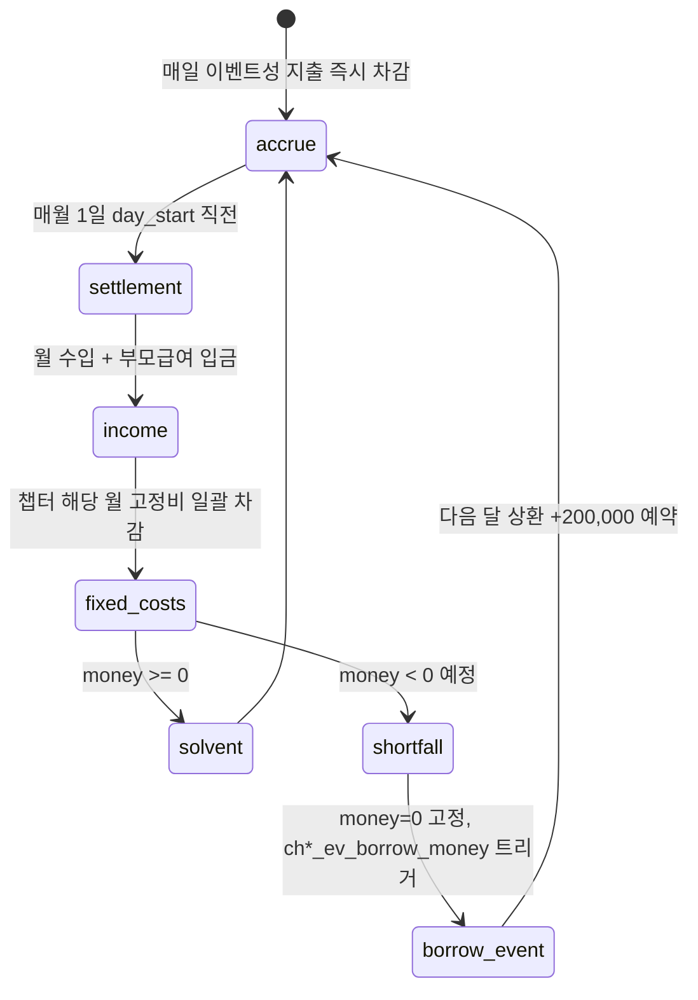

# 03_02 Resource Economy

## Purpose

가계(`money`)와 엄마 체력(`stamina`)의 수입원·지출처를 현실 물가 기준으로 데이터화한다(Pillar 2·3). 자원은 항상 부족하게 설계하되, 부족은 게임오버가 아니라 서사적 결과(이벤트·연출·선택지 변형)로만 나타난다(D-002). 수치 변화의 클램프·반올림·임계값 판정은 03_01을 따르며 본 문서는 소스·싱크와 정산 절차만 소유한다.

## Variables

### money 수입원 — 배경 프리셋별 (게임 시작 시 1택, `preset_id`)

| preset_id | 배경 | 월 수입(원) | 비고 |
|---|---|---|---|
| `preset_dual_income` | 맞벌이 (엄마 육아휴직) | 2,800,000 | 배우자 실수령 2,300,000 + 육아휴직급여 500,000 (CH1 한정, CH2부터 복직 선택 이벤트) |
| `preset_single_income` | 외벌이 | 2,600,000 | 배우자 실수령만. 엄마 `work` 블록 불가 대신 stamina 여유 |
| `preset_single_parent` | 한부모 | 1,900,000 | 본인 재택 부업 1,600,000 + 한부모가족 아동양육비 300,000 |

- 공통 수입: 부모급여(정부 지원) — 0~11개월 월 1,000,000, 12~23개월 월 500,000, 24개월~86개월(가정양육 시) 월 100,000. 매월 25일 자동 입금.
- 비정기 수입: 돌잔치 축의금 이벤트 `ch2_ev_doljanchi` 성사 시 +1,500,000 (지출 2,000,000과 상계, 순 −500,000).

### money 지출 표 (2026년 수도권 외곽 물가 기준, 12_DATABASE 상수)

| cost_id | 항목 | 금액(원) | 주기 | 적용 챕터 |
|---|---|---|---|---|
| `cost_formula` | 분유 | 120,000 | 월 고정 | CH1 |
| `cost_diaper` | 기저귀 | 90,000 | 월 고정 | CH1~CH2 |
| `cost_baby_food` | 이유식·유아식 재료 | 150,000 | 월 고정 | CH2~CH3 |
| `cost_housing` | 주거·관리비·공과금 | 1,200,000 | 월 고정 | 전 챕터 |
| `cost_living` | 생활비(식비·통신 등) | 700,000 | 월 고정 | 전 챕터 |
| `cost_daycare` | 어린이집 자부담(특별활동비 등) | 120,000 | 월 고정 | 입소 이벤트 성공 후 |
| `cost_hospital_minor` | 소아과 외래+약 | 25,000 | 이벤트 건별 | 전 챕터 |
| `cost_hospital_er` | 야간 응급실 | 120,000 | 이벤트 건별 | 전 챕터 |
| `cost_doljanchi` | 돌잔치 | 2,000,000 | 1회 | CH2 |
| `cost_hakwon` | 유아 학원(선택) | 250,000 | 월 고정(선택 후) | CH4~CH5 |
| `cost_school_prep` | 초등 입학 준비물 | 400,000 | 1회 | CH5 |

### stamina 소스·싱크

| 구분 | 항목 | 값 | 비고 |
|---|---|---|---|
| 소스 | night 수면 회복 | +8 ~ +25 | 03_01 sleep_score 표 |
| 소스 | 자기 돌봄(`self_care`) 블록 | +10 | mind +2와 별도 |
| 소스 | 배우자·조부모 도움 이벤트 | +5 ~ +15 | preset별 발생 빈도 상이 |
| 싱크 | 돌봄(`care`) 블록 | −8 | CH1은 −10 (신생아 가중) |
| 싱크 | 가사(`chores`) 블록 | −6 | |
| 싱크 | 일(`work`) 블록 | −10 | preset_dual_income 복직 후 |
| 싱크 | 이벤트 선택지 effects | 가변 | 예: 밤샘 간호 −15 |

### 자원 부족 상태 페널티 (게임오버 없음)

| 상태 | 진입 조건 | 서사적 결과 |
|---|---|---|
| `money_tight` | 월말 정산 후 money < 300,000 | 지출 선택지에 망설임 대사 변형, `comparison` 태그 이벤트 가중치 +30% |
| `money_debt_event` | 정산 시 잔액 부족(0 미만 예정) | money는 0으로 고정하고 `ch*_ev_borrow_money` 이벤트 강제 트리거(가족에게 빌리기/적금 해지 선택). 다음 달 고정비에 상환 200,000 추가 |
| `stamina_collapse` | stamina 0 도달 | 해당 블록 강제 휴식으로 전환(선택권 상실), `isolation`/`burnout` 연출 재생, mind −5 |

## State Machine

월 단위 가계 정산 사이클. 매월 1일의 `day_start` 직전에 실행된다.



## UI

- money는 블록 배분 화면 우상단에 원화 콤마 표기로 상시 노출(수치 5종 중 유일한 숫자 노출, 03_01 준수).
- 월 정산은 `day_end_summary`가 아닌 다음 날 `day_start`에 "이번 달 가계부" 1장 요약 카드로 표시: 수입/고정비/이벤트 지출/잔액 4행.
- `money_tight` 상태에서는 가격표 UI에 붉은 강조 대신 **엄마의 시선 연출**(가격을 두 번 보는 애니메이션)로 표현(D-004 정신).
- stamina는 게이지만 표시하고 숫자 미노출.

## Database

| 테이블 | 키 | 컬럼 | 비고 |
|---|---|---|---|
| `preset_def` | preset_id | monthly_income, work_block_allowed, notes | 배경 프리셋 상수 |
| `cost_def` | cost_id | amount, cycle(`monthly`/`per_event`/`once`), chapter_min, chapter_max | 지출 상수 테이블 |
| `benefit_def` | benefit_id | amount, month_min, month_max, pay_day | 부모급여 등 지원금 |
| `settlement_log` | save_id, month_index | income_total, fixed_total, event_total, balance_after, shortfall_flag | 가계부 UI 원천 |
| `stamina_delta_log` | save_id, day, seq | source_id, delta | 03_01 `stat_delta_log`의 뷰로 대체 가능 |

## JSON

```json
{
  "settlement": {
    "month_index": 13,
    "preset_id": "preset_dual_income",
    "income": [
      {"source_id": "preset_dual_income", "amount": 2800000},
      {"source_id": "benefit_parent_12_23m", "amount": 500000}
    ],
    "fixed_costs": [
      {"cost_id": "cost_housing", "amount": 1200000},
      {"cost_id": "cost_living", "amount": 700000},
      {"cost_id": "cost_diaper", "amount": 90000},
      {"cost_id": "cost_baby_food", "amount": 150000}
    ],
    "event_costs_total": 145000,
    "balance_after": 4015000,
    "shortfall_flag": false
  }
}
```

이벤트성 지출은 선택지 `effects`의 `money` 음수 값으로 기술한다: `"effects": {"money": -120000, "child_condition": 10}` (`ch1_ev_er_visit` 응급실 선택 예).

## QA

| TC | 사전 조건 | 절차 | 기대 결과 |
|---|---|---|---|
| RE-01 | preset_dual_income, 13개월차 | 월 정산 실행 | 수입 3,300,000 (월급 2,800,000+부모급여 500,000) 입금 |
| RE-02 | money 100,000, 고정비 2,140,000 | 월 정산 실행 | money 0 고정, `ch*_ev_borrow_money` 트리거, 게임오버 없음 |
| RE-03 | RE-02 다음 달 | 월 정산 실행 | 고정비에 상환 200,000 추가 차감 확인 |
| RE-04 | money 250,000 | 정산 완료 | `money_tight` 진입, comparison 이벤트 가중치 +30% |
| RE-05 | stamina 5, care 블록 선택 (−10) | 블록 해결 | stamina 0 클램프, 다음 블록 강제 휴식 + mind −5 |
| RE-06 | CH2 진입, cost_formula 활성 상태 | 챕터 전환 | `cost_formula` 정산 제외, `cost_baby_food` 편입 |
| RE-07 | 돌잔치 이벤트 성사 | 정산 로그 확인 | 지출 2,000,000·축의금 1,500,000 각각 기록, 순 −500,000 |
| RE-08 | preset_single_income | work 블록 선택 시도 | 선택지 미노출 (`work_block_allowed=false`) |
