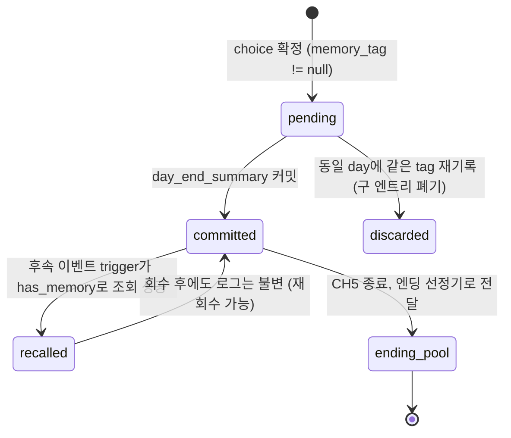

# 03_03 Memory Log System

## Purpose

`memory_log`는 주요 선택·사건의 영구 기록으로, "선택은 쌓여서 사람이 된다"(Pillar 4)의 기술적 구현체다. 기록된 `memory_tag`는 (1) 후속 이벤트의 `trigger.conditions`에서 존재/부재 조건으로 조회되고(D-010 conditional), (2) 대사 변형의 조건이 되며(08_DIALOGUE), (3) 엔딩의 기억 회상 시퀀스에 선정 후보로 전달된다. 본 문서는 명명 규칙, 기록 시점, 회수(callback) 매칭 규칙, 엔딩 인터페이스를 소유한다.

## Variables

### memory_log 엔트리 (전 문서 공용 스키마)

| 필드 | 타입 | 정의 |
|---|---|---|
| `day` | int ≥ 1 | 기록된 게임 내 일차 (`day_counter` 값) |
| `event_id` | string | 발생 이벤트 ID (예: `ch1_ev_001`) |
| `choice_id` | string | 플레이어가 고른 선택지 ID |
| `memory_tag` | string | 회수용 태그. 아래 명명 규칙 준수 |
| `emotion_tags` | string[] | 이벤트의 emotion_tags 복사본 (D-005로 항상 1개 이상) |

### memory_tag 명명 규칙

형식: `mem_{chapter}_{subject}` — 소문자 snake_case, 접두 `mem_` 고정.

| 세그먼트 | 규칙 | 예 |
|---|---|---|
| `{chapter}` | `ch1`~`ch5`. 챕터 무관 태그는 `any` | `mem_ch1_first_smile` |
| `{subject}` | 2~4단어 snake_case. 사건의 사실만 기술, 감정 단어 금지(감정은 emotion_tags 소관) | `mem_ch3_kindergarten_waitlist` |

- 같은 사건의 상반 선택은 접미로 구분: `mem_ch4_promise_kept` / `mem_ch4_promise_broken`.
- `memory_tag: null` 허용 — 회수 계획 없는 사소한 선택은 기록하지 않는다(로그 오염 방지). 단, Pillar 4 검증 질문("3챕터 뒤 어떤 형태로 되돌아오는가")에 답할 수 있는 선택지는 반드시 태그를 가진다.
- 신규 태그는 07_EVENT의 태그 레지스트리(`memory_tag_registry`)에 등록 후 사용. 미등록 태그는 콘텐츠 린트에서 리젝.

### 기록 시점

| 시점 | 동작 |
|---|---|
| choice 확정 직후 | `memory_tag`가 non-null이면 메모리 상 임시 버퍼(`pending_memories`)에 엔트리 생성 |
| `day_end_summary` 종료 | 버퍼를 `memory_log`에 커밋 (같은 day의 중복 `memory_tag`는 마지막 것만 유지) |
| autosave | 커밋된 `memory_log` 전체가 세이브에 포함 (03_04) |

## State Machine

단일 기억 엔트리의 생애 주기.



- `committed` 이후 엔트리는 **불변(immutable)**. 삭제·수정 API 없음.
- 회수는 소비가 아니다: 같은 태그를 여러 이벤트가 조회할 수 있다.

### 회수(callback) 매칭 규칙

후속 이벤트의 `trigger.conditions` 배열에서 다음 두 연산자를 사용한다(D-010 conditional 유형).

| 연산자 | 형식 | 의미 |
|---|---|---|
| `has_memory` | `{"type":"has_memory","memory_tag":"mem_ch1_night_holding"}` | 해당 태그 엔트리가 1개 이상 존재 |
| `lacks_memory` | `{"type":"lacks_memory","memory_tag":"mem_ch2_first_words_praise"}` | 해당 태그 엔트리가 0개 |

- conditions 배열은 **AND** 결합. OR가 필요하면 이벤트를 분리한다(QA 단순화, D-010 취지).
- 매칭 판정 시점: 각 `block_resolution` 시작 시의 트리거 평가 패스. `pending` 상태 엔트리는 매칭 대상에서 제외(당일 선택이 당일 회수되는 것 방지).
- 대사 변형도 동일 연산자를 사용하되 08_DIALOGUE의 라인 조건 필드에서 참조한다.

### 엔딩 인터페이스 (07_EVENT 엔딩 명세로 전달)

CH5 최종일 종료 시 엔딩 선정기에 아래 입력을 넘긴다.

| 입력 | 내용 |
|---|---|
| `memory_log` 전체 | committed 엔트리 배열 (day 오름차순) |
| `emotion_histogram` | emotion_tags별 누적 횟수 집계 |
| 선정 규칙 | 챕터당 1개 이상, 총 5~8개를 회상 시퀀스로 선정. 우선순위: (1) `ending_weight`가 높은 태그(레지스트리 정의), (2) 동률 시 emotion_histogram 상 희소 감정 우선, (3) 동률 시 최신 day 우선 |

## UI

- 평시 열람 UI: "기억 상자" 메뉴 — 커밋된 기억을 사진첩 형태로 표시. 수치·태그 문자열은 노출하지 않고 일러스트+한 줄 문장(`title_kr` 기반)만 표시.
- 회수 발생 장면에서는 별도 알림 없이 대사·연출 변화로만 표현(D-004). "기억이 회수되었습니다" 류의 시스템 메시지 금지.
- 엔딩 회상 시퀀스: 선정된 기억을 day 오름차순 슬라이드로 재생.

## Database

| 테이블 | 키 | 컬럼 | 비고 |
|---|---|---|---|
| `memory_log` | save_id, seq | day, event_id, choice_id, memory_tag, emotion_tags(json) | append-only |
| `memory_tag_registry` | memory_tag | chapter, description_kr, ending_weight(0~10), planned_callbacks(json) | 콘텐츠 린트·엔딩 선정 원천 |
| `memory_recall_log` | save_id, seq | day, event_id, memory_tag | 회수 발생 기록. QA 회수율 측정용 |

## JSON

기록 엔트리(공용 스키마 그대로)와 회수 트리거 예시.

```json
{"day": 12, "event_id": "ch1_ev_014", "choice_id": "ch1_ev_014_c1", "memory_tag": "mem_ch1_night_holding", "emotion_tags": ["overwhelmed"]}
```

```json
{
  "event_id": "ch4_ev_031",
  "chapter": 4,
  "title_kr": "잠들기 전, 오래된 이야기",
  "emotion_tags": ["reconciliation"],
  "trigger": {
    "type": "conditional",
    "conditions": [
      {"type": "has_memory", "memory_tag": "mem_ch1_night_holding"},
      {"type": "lacks_memory", "memory_tag": "mem_ch4_promise_broken"},
      {"stat": "attachment", "op": "gte", "value": 60}
    ]
  },
  "priority": 20,
  "scenes": [],
  "choices": [
    {"choice_id": "ch4_ev_031_c1", "text_kr": "그때처럼 안아준다", "effects": {"attachment": 2}, "memory_tag": "mem_ch4_night_holding_again"}
  ],
  "once": true,
  "cooldown_days": 0
}
```

## QA

| TC | 사전 조건 | 절차 | 기대 결과 |
|---|---|---|---|
| ML-01 | choice에 memory_tag 정의 | choice 확정 → day_end_summary | memory_log에 엔트리 1건 커밋, autosave 포함 |
| ML-02 | 같은 day에 같은 tag 2회 기록 | 커밋 확인 | 마지막 엔트리만 유지 |
| ML-03 | 당일 pending 상태 태그 | 같은 날 has_memory 트리거 평가 | 매칭 실패 (당일 회수 금지) |
| ML-04 | mem_ch1_night_holding 존재 | CH4에서 ch4_ev_031 트리거 평가 | 나머지 조건 충족 시 발생 (AND 결합 확인) |
| ML-05 | 미등록 태그 사용 이벤트 | 콘텐츠 린트 실행 | 리젝 |
| ML-06 | 감정 단어 포함 태그 `mem_ch2_sad_day` | 린트 실행 | 명명 규칙 위반 리젝 |
| ML-07 | CH5 종료, 로그 40건 | 엔딩 선정기 실행 | 챕터당 1개 이상·총 5~8개 선정, ending_weight 우선순위 준수 |
| ML-08 | 회수 발생 장면 | 화면 검사 | 시스템 알림 0건, memory_recall_log에 1건 기록 |
