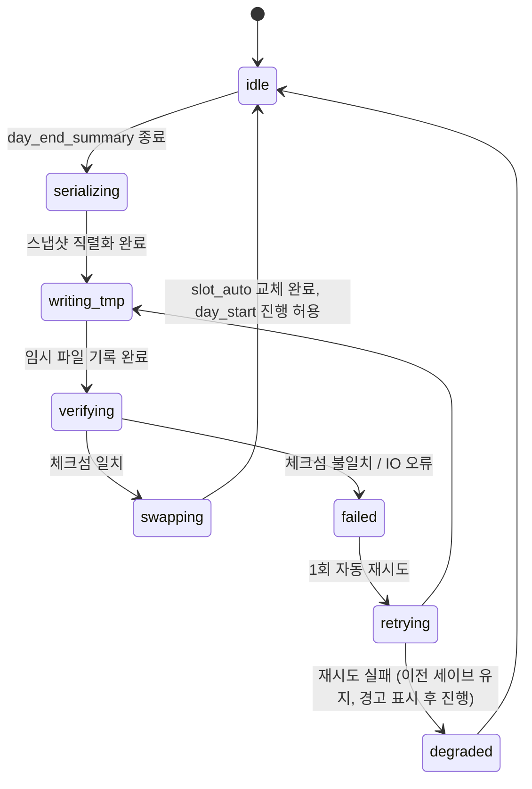

# 03_04 Save System

## Purpose

세이브 시스템은 하루 루프의 종점(`day_end_summary → autosave`)에서 플레이 상태를 무손실로 보존한다. 게임오버가 없으므로(D-002) 세이브는 "실패 대비 백업"이 아니라 **하루 단위의 일기장**으로 설계한다: 자동 저장은 항상 최신 하루를 덮어쓰고, 수동 슬롯은 플레이어가 남기고 싶은 시점을 고정한다. 본 문서는 저장 시점, 데이터 구성, 슬롯 정책, 버전 마이그레이션 규칙을 소유한다. 각 필드의 의미는 03_01~03_03이 소유하고 여기서는 직렬화만 다룬다.

## Variables

### 저장 시점

| 시점 | 종류 | 대상 슬롯 |
|---|---|---|
| `day_end_summary` 종료 직후 (autosave 단계) | 자동 | `slot_auto` 덮어쓰기 |
| 챕터 전환 직전 | 자동(추가) | `slot_auto` + 내부 챕터 백업 `chapter_backup_{n}` (플레이어 비노출, 마이그레이션 실패 복구용) |
| 플레이어 수동 저장 (블록 배분 화면에서만 가능) | 수동 | `slot_manual_1`~`slot_manual_3` 중 1택 |
| 이벤트 scenes 재생 중 | 저장 금지 | — (상태 불변 보장) |

### 저장 데이터 구성

| 최상위 키 | 내용 | 소유 문서 |
|---|---|---|
| `save_meta` | save_version, preset_id, created_at, play_time_sec, slot_id | 본 문서 |
| `day_counter` | 게임 내 일차 (int ≥ 1), 파생값 chapter·month_index는 저장하지 않고 로드 시 재계산 | 02_GAME_DESIGN |
| `player_state` | attachment, stamina, mind, money | 03_01 |
| `child_state` | child_condition, confidence, empathy, independence, expressiveness | 03_01 |
| `memory_log` | committed 엔트리 배열 (pending은 저장 대상 아님 — 커밋이 autosave보다 선행) | 03_03 |
| `event_history` | 발생 이벤트 기록: event_id, day, chosen choice_id, cooldown 만료 day. `once`·`cooldown_days` 판정 원천 | 07_EVENT |
| `settlement_state` | 다음 정산 예약(상환 포함), 활성 cost_id 목록 | 03_02 |

### 세이브 슬롯 정책 (자동 1 + 수동 3)

| slot_id | 쓰기 주체 | 덮어쓰기 | 삭제 |
|---|---|---|---|
| `slot_auto` | 시스템 전용 | 매일 자동 | 불가 (새 게임 시작 시에만 초기화, 확인 2회) |
| `slot_manual_1`~`slot_manual_3` | 플레이어 | 확인 후 가능 | 가능 |
| `chapter_backup_1`~`chapter_backup_5` | 시스템 내부 | 챕터당 1회 고정 | 시스템만 |

- 쓰기는 원자적으로 수행: 임시 파일 작성 → 체크섬 검증 → 원본 교체. 실패 시 이전 파일 유지.
- 로드 시 체크섬 불일치 → 해당 슬롯을 `corrupted`로 표시하고 최근 `chapter_backup`을 복구 후보로 제시.

### 버전 마이그레이션 규칙

`save_version`은 `MAJOR.MINOR` 정수 쌍 (init `1.0`).

| 상황 | 규칙 |
|---|---|
| MINOR 증가 (필드 추가) | 무손실 자동 마이그레이션 **필수**. 신규 필드는 정의된 기본값으로 채움 (기본값은 마이그레이션 스크립트에 명시, 03_01 init 표 준용) |
| MAJOR 증가 (필드 의미 변경·제거) | 전용 마이그레이터 필수. 마이그레이터 없는 MAJOR 로드는 거부하고 사유 표시 |
| 다운그레이드 (세이브 버전 > 클라이언트 버전) | 로드 거부. 덮어쓰기 금지 |
| 마이그레이션 실행 | 로드 시 수행하고, 성공 후 **원본은 `pre_migration_backup`으로 1회 보존**한 뒤 새 버전으로 재저장 |
| 체인 적용 | 1.0 → 1.2 로드는 1.0→1.1, 1.1→1.2 순차 적용. 건너뛰기 금지 |

## State Machine

autosave 파이프라인의 상태 전이.



- `serializing`은 시뮬레이션 정지 상태에서 수행 (day_end와 day_start 사이라 상태 변동 없음).
- `degraded`로 하루를 진행해도 다음 날 autosave가 성공하면 정상 복귀 (누락일은 event_history로 재구성 불가하므로 경고만).

## UI

- autosave 진행 표시는 `day_end_summary` 우하단의 작은 아이콘 1개로 한정 (감정 여운을 깨는 팝업 금지, D-004 정신).
- 슬롯 선택 화면: 슬롯별로 day_counter, 챕터, 아이 나이 표기(예: "D+412 · CH2 · 14개월"), 마지막 기억 1장 썸네일(03_03 기억 상자 연동). 수치 5종은 표시하지 않는다.
- 수동 저장 덮어쓰기 확인 문구는 대상 슬롯의 day 표기를 포함: "D+201의 기록을 덮어쓸까요?"
- `corrupted` 슬롯은 에러 코드 대신 "이 날의 기록을 읽을 수 없어요" + 복구 후보 제시.

## Database

로컬 파일 저장(PC/Steam, D-006) + 인덱스 테이블.

| 저장소 | 경로/테이블 | 내용 |
|---|---|---|
| 파일 | `saves/{slot_id}.json.gz` | 스냅샷 본문 (gzip) |
| 파일 | `saves/{slot_id}.meta.json` | save_meta + sha256 체크섬 (슬롯 목록 화면은 이것만 읽음) |
| 파일 | `saves/backup/chapter_backup_{n}.json.gz` | 챕터 백업 |
| SQLite | `save_index` (slot_id PK, save_version, day_counter, chapter, updated_at, checksum, status(`ok`/`corrupted`)) | 슬롯 목록·무결성 캐시 |
| SQLite | `migration_log` (id PK, slot_id, from_version, to_version, applied_at, result) | 마이그레이션 감사 로그 |

## JSON

```json
{
  "save_meta": {"save_version": "1.0", "slot_id": "slot_auto", "preset_id": "preset_worker", "created_at": "2026-07-24T13:02:11+09:00", "play_time_sec": 43210},
  "day_counter": 12,
  "player_state": {"attachment": 48, "stamina": 62, "mind": 55, "money": 2374000},
  "child_state": {"child_condition": 71, "confidence": 50, "empathy": 52, "independence": 49, "expressiveness": 51},
  "memory_log": [
    {"day": 12, "event_id": "ch1_ev_014", "choice_id": "ch1_ev_014_c1", "memory_tag": "mem_ch1_night_holding", "emotion_tags": ["overwhelmed"]}
  ],
  "event_history": [
    {"event_id": "ch1_ev_014", "day": 12, "choice_id": "ch1_ev_014_c1", "cooldown_until_day": 15}
  ],
  "settlement_state": {"active_cost_ids": ["cost_formula", "cost_diaper", "cost_housing", "cost_living"], "pending_repayment": 0, "next_settlement_day": 31}
}
```

## QA

| TC | 사전 조건 | 절차 | 기대 결과 |
|---|---|---|---|
| SV-01 | 정상 플레이 12일차 | day_end_summary 종료 | slot_auto 갱신, day_counter=12, 체크섬 일치 |
| SV-02 | autosave 중 프로세스 강제 종료 | 재실행 후 로드 | 이전 세이브(11일차)로 무결 로드, corrupted 미발생 |
| SV-03 | 이벤트 scenes 재생 중 | 수동 저장 시도 | 저장 메뉴 비활성 |
| SV-04 | slot_manual_2에 기존 세이브 | 덮어쓰기 저장 | day 표기 포함 확인 문구 → 확인 후에만 덮어쓰기 |
| SV-05 | save_version 1.0 세이브, 클라이언트 1.1 | 로드 | 신규 필드 기본값 채움, pre_migration_backup 생성, 1.1로 재저장 |
| SV-06 | save_version 2.0 세이브, 클라이언트 1.1 | 로드 시도 | 거부 + 사유 표시, 파일 불변 |
| SV-07 | save_version 1.0, 클라이언트 1.2 | 로드 | 1.0→1.1→1.2 체인 순차 적용, migration_log 2건 |
| SV-08 | meta 체크섬 훼손 | 슬롯 목록 진입 | corrupted 표시 + chapter_backup 복구 후보 제시 |
| SV-09 | 로드 직후 | event_history 검사 | once 이벤트 재발생 없음, cooldown_until_day 준수 |
| SV-10 | pending 기억 있는 상태에서 로드 검사 | 세이브 파일 파싱 | memory_log에 committed 엔트리만 존재 |
