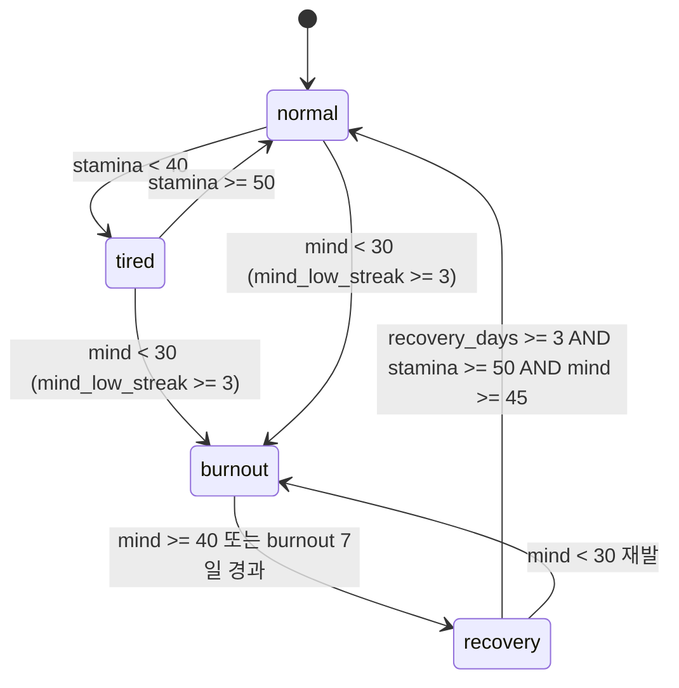

# 04_02 Player Stats

## Purpose

엄마 체력(`stamina`)과 엄마 마음(`mind`)의 회복·소모 규칙, 그리고 번아웃 상태 머신을 정의한다. 두 수치는 "자원은 항상 부족하다"(Pillar 2)를 구현하는 축이며, 낮아졌을 때 처벌(게임오버)이 아니라 선택지·연출의 변화(D-002, D-004)로 표현된다.

## Variables

| 식별자 | 한국어 | 범위 | 초기값 | 설명 |
|---|---|---|---|---|
| `stamina` | 엄마 체력 | 0~100 | 70 (D-009) | 시간 블록 행동의 비용 자원. 04_03의 행동별 비용으로 소모 |
| `mind` | 엄마 마음 | 0~100 | 60 (D-009) | 번아웃 지표. 이벤트 `effects`와 상태 머신으로 변동 |
| `player_state` | 엄마 상태 | enum | `normal` | `normal` / `tired` / `burnout` / `recovery` |
| `mind_low_streak` | 마음 저하 연속 일수 | 0~ | 0 | day_end 시점 `mind` < 30이면 +1, 아니면 0으로 리셋 |
| `recovery_days` | 회복 경과 일수 | 0~ | 0 | `recovery` 진입 후 경과 일수 |

### 소모 규칙

| 원인 | 변화 | 비고 |
|---|---|---|
| 시간 블록 행동 수행 | `stamina` −8 ~ −20 | 행동별 비용은 04_03 표 기준 |
| 밤 블록 아이 깨움(night_waking) | `stamina` −10, `mind` −3 | CH1 발생률: 05_01 기질 보정 적용 |
| 이벤트 선택 `effects` | `mind` ±1 ~ ±8 | 부정 감정 이벤트는 `mind` 감소가 기본 |
| `stamina` 0 도달 | 해당 블록 행동 강제 취소, `mind` −5 | 실패 아님. "주저앉는" 연출로 처리 |

### 회복 규칙

| 원인 | 변화 | 조건 |
|---|---|---|
| 밤 블록 수면 | `stamina` +25 | night_waking 발생 시 +12로 감소 |
| `selfcare` 카테고리 행동 | `stamina` +5~+15, `mind` +4~+10 | 04_03 행동별 값 |
| `husband_support` ≥ 60 밤 분담 | `stamina` 추가 +6 | 04_01 참조 |
| 애착 이벤트의 긍정 선택 | `mind` +2~+6 | `wonder`, `reward` 태그 이벤트 중심 |

## State Machine



- 판정 시점: 매일 `day_end_summary` 직전 1회. 블록 중간에는 상태가 바뀌지 않는다.
- `burnout` 진입 시 conditional 회복 이벤트(`ch*_ev_recovery_*` 계열: 남편의 개입, 친정 방문, 상담)가 우선순위(priority) 최상위로 큐잉된다.
- 히스테리시스(진입 40 / 해제 50)로 상태 진동을 방지한다.

## UI

D-004에 따라 수치·상태명을 직접 노출하지 않고 연출로 표현한다.

| `player_state` | 선택지 변화 | 연출 변화 |
|---|---|---|
| `normal` | 전 행동 선택 가능 | 기본 톤 |
| `tired` | `stamina` 비용 15 이상 행동에 "…할 수 있을까" 망설임 문구, 비용 +20% | 걸음 애니메이션 느려짐, 화면 채도 −10% |
| `burnout` | `work`·`outing` 카테고리 선택 잠금, 일부 이벤트에서 다정한 선택지 1개 비활성(회색 처리) | 배경음 뮤트, 대사 말줄임 증가, 흐린 화면 비네트 |
| `recovery` | 잠금 해제, `selfcare` 행동 효과 +50% | 채도 단계적 복원, 창밖 빛 연출 |

- 홈 화면 상시 UI에도 게이지 숫자는 없으며, 엄마 스프라이트의 자세·다크서클 3단계로만 암시한다.

## Database

| 테이블 | 컬럼 | 타입 | 비고 |
|---|---|---|---|
| `player_stats` | `save_id` | FK | 세이브 슬롯 |
| | `stamina` / `mind` | int | 0~100 clamp |
| | `player_state` | text | enum 4종 |
| | `mind_low_streak` / `recovery_days` | int | 상태 머신 카운터 |
| `player_state_log` | `day`, `prev_state`, `next_state`, `cause` | int/text | 상태 전이 이력. QA·밸런싱 분석용 |

## JSON

세이브 스냅샷과 상태 전이 로그 예시:

```json
{
  "player_stats": {
    "stamina": 36,
    "mind": 28,
    "player_state": "tired",
    "mind_low_streak": 2,
    "recovery_days": 0
  },
  "player_state_log": [
    {"day": 41, "prev_state": "normal", "next_state": "tired", "cause": "stamina_below_40"}
  ]
}
```

## QA

| ID | 시나리오 | 통과 기준 |
|---|---|---|
| QA-0402-01 | `stamina` 39로 day_end 도달 | `player_state`가 `tired`로 전이, 로그 기록 |
| QA-0402-02 | `tired`에서 `stamina` 49 유지 | `normal` 복귀하지 않음 (히스테리시스 확인) |
| QA-0402-03 | `mind` 29로 3일 연속 day_end | 3일째에만 `burnout` 전이. 2일째 전이 시 실패 |
| QA-0402-04 | `burnout` 중 `work` 행동 선택 시도 | 선택 불가, 잠금 연출 표시. 게임오버·패널티 팝업 없음 (D-002) |
| QA-0402-05 | `burnout` 7일 경과, `mind` 35 | 자동으로 `recovery` 전이 (탈출 보장 확인) |
| QA-0402-06 | 감정 장면 중 상태 전이 발생 | 수치·상태명 텍스트가 화면에 노출되지 않음 (D-004) |
