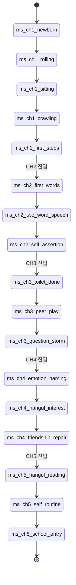

# 05_02 Growth State Machine

## Purpose

아이의 챕터별 발달 마일스톤을 상태 머신으로 정의한다. 마일스톤은 "일상의 변주"(01_04 감정 전달 수단 2순위)의 핵심 소재이며, 지연은 실패가 아니라 개인차·질병의 서사로 처리한다(D-002). 도달 시점의 차이가 각 플레이의 기억을 다르게 만든다.

## Variables

| 식별자 | 한국어 | 타입 | 설명 |
|---|---|---|---|
| `growth_stage` | 현재 발달 단계 | enum | 아래 마일스톤 id 중 현재 도달한 최신 값 |
| `milestone_id` | 마일스톤 식별자 | text | 규칙: `ms_ch{챕터}_{name}` (예: `ms_ch1_rolling`) |
| `chapter_day` | 챕터 내 경과 일수 | int | 챕터 시작일 = 1 |
| `condition_avg7` | 최근 7일 `child_condition` 평균 | float | 매일 day_end에 갱신 |
| `delay_flag` | 지연 플래그 | bool | 보장일 초과 전까지 표준일 +14일 초과 시 true |

### 마일스톤 도달 조건표

판정: 매일 `day_end_summary` 시점. `chapter_day` ≥ 표준일 AND `condition_avg7` ≥ 컨디션 조건이면 다음날 morning 블록에 마일스톤 연출 발생. 보장일에는 조건 미달이어도 무조건 도달한다(지연 서사 동반).

| milestone_id | 한국어 | 챕터 | 표준일 | 보장일 | 컨디션 조건 | 보조 조건 |
|---|---|---|---|---|---|---|
| `ms_ch1_newborn` | 신생아 | CH1 | 1 (시작 상태) | — | — | — |
| `ms_ch1_rolling` | 뒤집기 | CH1 | 90 | 150 | ≥ 55 | `act_care_tummy_time` 누적 5회 시 표준일 −10 |
| `ms_ch1_sitting` | 혼자 앉기 | CH1 | 180 | 230 | ≥ 55 | rolling 도달 후 60일 경과 |
| `ms_ch1_crawling` | 기어다니기 | CH1 | 240 | 290 | ≥ 55 | sitting 도달 필수 |
| `ms_ch1_first_steps` | 첫 걸음 | CH1 | 330 | 365 | ≥ 60 | crawling 도달 필수. CH1 클라이맥스 연출 |
| `ms_ch2_first_words` | 첫 단어 | CH2 | 60 | 150 | ≥ 55 | `act_care_reading_picturebook` 누적 8회 시 표준일 −15 |
| `ms_ch2_two_word_speech` | 두 단어 문장 | CH2 | 300 | 420 | ≥ 55 | first_words 도달 후 120일 경과 |
| `ms_ch2_self_assertion` | 자기주장("싫어") | CH2 | 480 | 600 | ≥ 50 | two_word_speech 도달 필수. `burnout` 감정 목표 진입점 |
| `ms_ch3_toilet_done` | 배변 훈련 완료 | CH3 | 90 | 240 | ≥ 60 | 배변 훈련 이벤트 체인 3회 완료 |
| `ms_ch3_peer_play` | 또래와 어울려 놀기 | CH3 | 200 | 330 | ≥ 55 | `act_outing_playdate` 또는 등원 누적 20회 |
| `ms_ch3_question_storm` | 질문 폭발("왜?") | CH3 | 300 | 400 | ≥ 50 | `expressiveness` ≥ 40이면 표준일 −20 |
| `ms_ch4_emotion_naming` | 감정을 말로 표현 | CH4 | 60 | 180 | ≥ 55 | `act_care_emotion_talk` 누적 5회 시 표준일 −15 |
| `ms_ch4_hangul_interest` | 한글에 관심 | CH4 | 150 | 270 | ≥ 55 | `act_outing_library`·`act_care_hangul_play` 누적 6회 시 −20 |
| `ms_ch4_friendship_repair` | 친구와 다투고 화해 | CH4 | 240 | 330 | ≥ 55 | `empathy` ≥ 40이면 화해 연출 강화 |
| `ms_ch5_hangul_reading` | 짧은 문장 읽기 | CH5 | 90 | 210 | ≥ 55 | hangul_interest 도달 필수 |
| `ms_ch5_self_routine` | 스스로 등원 준비 | CH5 | 180 | 280 | ≥ 55 | `independence` ≥ 50이면 표준일 −20 |
| `ms_ch5_school_entry` | 초등학교 입학 | CH5 | 챕터 종료일 | 동일 | — | scheduled 고정. 게임 피날레 |

## State Machine



- 전이는 단방향·순차이며 되돌아가지 않는다. 챕터 경계에서 미도달 마일스톤은 다음 챕터 초반 보장일 규칙으로 이월 처리한다.

### 지연의 서사 처리 (실패 아님)

| 상황 | 처리 |
|---|---|
| 표준일 +14일 초과 (`delay_flag` = true) | conditional 이벤트 `ch*_ev_delay_worry` 발생: 맘카페 비교 글, 검진에서 의사의 "아이마다 달라요" 대사. `emotion_tags`: `worry`, `comparison` |
| 지연 원인이 질병 이벤트와 겹침 | 회복 이벤트 체인 후 컨디션 조건을 5 완화. "아팠으니까 천천히" 서사 |
| 보장일 도달 | 무조건 마일스톤 발생 + 안도 연출. 수치 페널티 없음, memory_tag `late_bloomer` 기록 |
| 표준일보다 빠른 도달 | 과장된 보상 없음(Pillar 2). 담담한 경이(`wonder`) 연출만 |

## UI

- 마일스톤 도달 장면은 감정 장면으로 분류되어 모든 수치 UI를 숨긴다(D-004).
- 홈 화면의 "성장 앨범"에서 도달한 마일스톤을 사진첩 형태로 열람. 날짜만 표기하고 "빠름/늦음" 비교 표기는 금지한다.
- 지연 중에는 별도 경고 아이콘을 띄우지 않는다. 지연은 이벤트 서사로만 전달한다.

## Database

| 테이블 | 컬럼 | 타입 | 비고 |
|---|---|---|---|
| `milestone_def` | `milestone_id`, `chapter`, `std_day`, `guarantee_day`, `condition_min`, `prereq_id` | text/int | 정적 정의 (본 문서 표와 동기화) |
| `milestone_log` | `save_id`, `milestone_id`, `reached_day`, `delayed` | FK/text/int/bool | 도달 이력. 성장 앨범·엔딩 회수(memory_log 연동)의 원천 |

## JSON

```json
{
  "growth_state": {
    "growth_stage": "ms_ch1_sitting",
    "chapter_day": 195,
    "condition_avg7": 62.4,
    "delay_flag": false
  },
  "milestone_log": [
    {"milestone_id": "ms_ch1_rolling", "reached_day": 96, "delayed": false},
    {"milestone_id": "ms_ch1_sitting", "reached_day": 195, "delayed": true}
  ]
}
```

## QA

| ID | 시나리오 | 통과 기준 |
|---|---|---|
| QA-0502-01 | `condition_avg7` 54로 표준일 도달 | 마일스톤 미발생, 다음날부터 매일 재판정 |
| QA-0502-02 | 조건 미달 상태로 보장일 도달 | 마일스톤 강제 발생 + `late_bloomer` 기록, 페널티 없음 |
| QA-0502-03 | 선행 마일스톤 미도달 상태에서 후행 조건 충족 | 후행 마일스톤 발생하지 않음 (순차성) |
| QA-0502-04 | `delay_flag` true 진입 | `ch*_ev_delay_worry` 1회만 발생 (`once`: true) |
| QA-0502-05 | 마일스톤 연출 중 UI 검사 | 수치 UI 요소 0개 노출 (D-004) |
| QA-0502-06 | `act_care_tummy_time` 5회 누적 | `ms_ch1_rolling` 표준일이 90 → 80으로 단축 |
