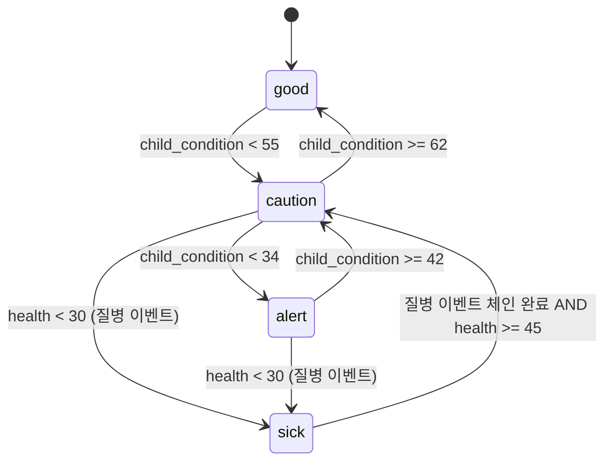

# 05_03 Child Stats and Personality

## Purpose

아이 컨디션(`child_condition`)의 하위 구성과 성격 축 4종(D-008)의 변화 규칙을 정의한다. 컨디션은 단기 돌봄의 결과, 성격 축은 선택 누적의 결과(Pillar 4)로 역할을 분리한다. 기질(`temperament_seed`, 05_01)은 선천 보정 계수일 뿐 본 문서의 두 체계 어느 쪽의 값도 직접 바꾸지 않는다.

## Variables

### child_condition 하위 요소

| 식별자 | 한국어 | 범위 | 초기값 | 주요 변동 원인 |
|---|---|---|---|---|
| `sleep` | 수면 | 0~100 | 70 | `act_care_lull_sleep` +8, 밤 울음 −10(기질 보정 ×), 규칙적 저녁 루틴 +3/일 |
| `nutrition` | 영양 | 0~100 | 70 | `act_care_feeding` +8, 식사 거름 −12, 편식 이벤트 −5 |
| `health` | 건강 | 0~100 | 70 | 질병 이벤트 −15~−30, `act_outing_clinic` +10, 산책 +2 |

합성식 (매 블록 종료 시 재계산, 반올림):

```
child_condition = round(0.35 * sleep + 0.35 * nutrition + 0.30 * health)
```

- 초기값 검산: 0.35×70 + 0.35×70 + 0.30×70 = 70 → D-009의 초기값 70과 일치.
- 이벤트 `effects`의 `"child_condition": n` 표기는 하위 3요소에 n을 동일 적용하는 축약 표기다. 특정 요소만 바꿀 때는 `"sleep": n`처럼 하위 키를 직접 쓴다.
- 자연 감쇠: 하위 3요소는 매일 day_end에 −2 (돌봄 없이 유지되는 컨디션은 없다, Pillar 2).

### 성격 축 4종 (D-008)

| 식별자 | 한국어 | 범위 | 초기값 |
|---|---|---|---|
| `confidence` | 자신감 | 0~100 | 50 |
| `empathy` | 공감 | 0~100 | 50 |
| `independence` | 자립심 | 0~100 | 50 |
| `expressiveness` | 표현력 | 0~100 | 50 |

변화 규칙:

1. 성격 축은 **선택지·행동의 `effects`로만** 변한다. 자연 감쇠·랜덤 변동·기질에 의한 직접 변동은 없다.
2. 1회 선택의 축당 변동 상한은 **±3** (기질 계수 적용·반올림 후에도 클램프).
3. 단일 선택으로 축 구간(low/mid/high)을 건너뛰는 설계 금지 — 극적 분기 금지 원칙(Pillar 4)의 수치 구현.
4. 모든 축 변동은 발생 시점의 `memory_log` 엔트리와 함께 기록되어 후반 이벤트에서 회수된다.

## State Machine

`child_condition`의 종합 상태(`condition_state`). 판정은 매일 day_end, 히스테리시스로 진동 방지.



- `alert`·`sick`은 게임오버가 아니다(D-002). 병원 이벤트 체인과 회복 서사로 이어지며, 회복 후 `attachment` 보너스 이벤트(간병의 유대)가 큐잉된다.
- 성격 축의 구간(low/mid/high)은 상태 머신이 아니라 조회 시점의 단순 구간 판정이다(전이 이벤트 없음).

### 성격 축 구간 정의

| 축 | 낮음 (0~33) | 중간 (34~66) | 높음 (67~100) |
|---|---|---|---|
| `confidence` | 새 시도 앞에서 멈칫하고 엄마를 돌아본다 | 익숙한 일은 해내고 낯선 일은 눈치를 본다 | 처음 보는 놀이기구에 먼저 다가간다 |
| `empathy` | 친구의 울음에 관심을 두지 않는다 | 어른이 짚어주면 타인의 감정을 알아챈다 | 우는 친구에게 자기 손수건을 내민다 |
| `independence` | 신발 신기부터 엄마를 부른다 | 하다가 막히면 도움을 청한다 | "내가 할래"가 입버릇, 등원 가방을 스스로 챙긴다 |
| `expressiveness` | 원하는 것을 울음·행동으로만 표현한다 | 묻는 말에는 또렷이 답한다 | 오늘 있었던 일을 묻기 전에 먼저 재잘거린다 |

- 구간별 실제 연출(대사·애니메이션 매핑)은 05_04에서 정의한다.

## UI

- `child_condition`과 하위 3요소의 숫자는 어디에도 표시하지 않는다(D-004). 홈 화면 아이 스프라이트의 혈색·눈 깜빡임·자세 3단계(`good`/`caution`/`alert`)로만 암시한다.
- `sick` 상태는 이마의 열 시트, 기침 SFX 등 명시적 연출을 사용한다(질병 은폐는 혼란만 유발).
- 성격 축은 게임 중 어떤 화면에도 수치·그래프로 노출하지 않는다. 엔딩의 "아이의 모습" 서술과 성장 앨범 문장으로만 회수한다.

## Database

| 테이블 | 컬럼 | 타입 | 비고 |
|---|---|---|---|
| `child_stats` | `save_id`, `sleep`, `nutrition`, `health`, `condition_state` | FK/int×3/text | `child_condition`은 저장하지 않고 항상 합성식으로 계산 (정합성 단일화) |
| `child_personality` | `save_id`, `confidence`, `empathy`, `independence`, `expressiveness` | FK/int×4 | 0~100 clamp |
| `personality_delta_log` | `day`, `axis`, `delta`, `event_id`, `choice_id` | int/text | 축 변동 전수 기록. 밸런싱·회수 이벤트 조건 검색용 |

## JSON

```json
{
  "child_stats": {
    "sleep": 64,
    "nutrition": 71,
    "health": 58,
    "condition_state": "good"
  },
  "child_personality": {
    "confidence": 55,
    "empathy": 61,
    "independence": 43,
    "expressiveness": 58
  },
  "personality_delta_log": [
    {"day": 412, "axis": "empathy", "delta": 2, "event_id": "ch2_ev_017", "choice_id": "ch2_ev_017_c1"}
  ]
}
```

## QA

| ID | 시나리오 | 통과 기준 |
|---|---|---|
| QA-0503-01 | sleep 64, nutrition 71, health 58 | `child_condition` = round(22.4+24.85+17.4) = 65 |
| QA-0503-02 | `effects`에 `"confidence": 5` 기재된 테스트 이벤트 | 적용값 +3으로 클램프, `personality_delta_log`에 +3 기록 |
| QA-0503-03 | 30일간 아무 돌봄 없이 방치 시뮬레이션 | 하위 요소 자연 감쇠 −2/일 적용, `alert` 전이·게임오버 미발생 (D-002) |
| QA-0503-04 | `child_condition` 55~62 구간 반복 진입 | `good`↔`caution` 진동 없음 (히스테리시스) |
| QA-0503-05 | 기질 3종으로 동일 선택 재생 | 성격 축 최종값 동일 (05_01 QA-0501-02와 교차 검증) |
| QA-0503-06 | 전 화면 스캔 | 성격 축·하위 요소 수치 노출 0건 (D-004) |
