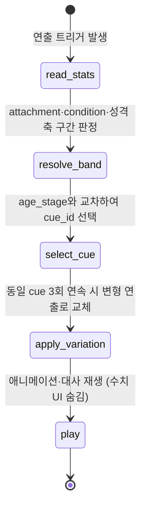

# 05_04 Child Behavior Expression

## Purpose

D-004("감정 장면에서 수치 UI 숨김, 수치는 행동·연출로 간접 표현")의 구현 핵심 문서. 애착도(`attachment`)·아이 컨디션(`child_condition`)·성격 축 구간을 아이의 구체적 행동 연출로 번역하는 매핑 테이블을 정의한다. 플레이어는 숫자가 아니라 "하원 때 달려와 안기는가, 등을 돌리는가"로 상태를 읽는다(Pillar 1).

## Variables

| 식별자 | 타입 | 설명 |
|---|---|---|
| `age_stage` | enum | 표현 수단 단계: `infant`(신생아·영아, CH1) / `toddler`(유아, CH2~CH3) / `child`(아동, CH4~CH5) |
| `cue_id` | text | 행동 연출 식별자. 규칙: `cue_{수치}_{구간}_{age_stage}` (예: `cue_att_high_toddler`) |
| 구간 표기 | enum | `low`(0~33) / `mid`(34~66) / `high`(67~100). 05_03의 축 구간과 동일 경계 |

### 연령대별 표현 수단 차이

| `age_stage` | 챕터 | 1차 표현 수단 | 2차 수단 | 말(대사) 사용 |
|---|---|---|---|---|
| `infant` | CH1 | 울음 패턴(길이·톤·달램 반응) | 시선·손짓·수면 자세 | 없음 (옹알이만) |
| `toddler` | CH2~CH3 | 행동(안기기, 등 돌리기, 떼쓰기, 손 잡기) | 한두 단어 발화 | 최소한. 짧은 단어 위주 |
| `child` | CH4~CH5 | 말(문장) + 행동의 조합 | 표정·침묵·방문 닫기 | 주 수단. 단, 절제된 문장 (01_04 금지사항) |

## State Machine

연출 선택 파이프라인. 매 연출 시점(장면 진입·하원·취침 등 트리거 포인트)마다 실행된다.



- 우선순위: 이벤트 고유 연출 > 컨디션 cue(`sick` 등 긴급) > 애착 cue > 성격 축 cue.
- `apply_variation`: 같은 cue의 반복 노출을 막기 위해 cue당 변형 연출 최소 3종을 10_ART에 발주한다.

### 매핑 1 — 애착도(attachment) × 연령대

| 구간 | `infant` (CH1) | `toddler` (CH2~3) | `child` (CH4~5) |
|---|---|---|---|
| high (67+) | `cue_att_high_infant`: 엄마 목소리에 울음이 잦아들고, 눈을 맞추며 옹알이 | `cue_att_high_toddler`: 하원 때 달려와 안김. 놀다가도 돌아보며 엄마 확인 | `cue_att_high_child`: 학교(유치원) 일을 먼저 재잘거림. "엄마 이거 봐봐" |
| mid (34~66) | `cue_att_mid_infant`: 달래면 그치지만 시간이 걸림. 시선이 자주 벗어남 | `cue_att_mid_toddler`: 하원 때 손은 잡지만 안기지는 않음 | `cue_att_mid_child`: 물으면 답하지만 먼저 말을 꺼내지 않음 |
| low (0~33) | `cue_att_low_infant`: 안아도 몸이 굳어 있고 울음이 오래 감. 등을 젖힘 | `cue_att_low_toddler`: 하원 때 등 돌리고 혼자 놀기. 손을 빼냄 | `cue_att_low_child`: 단답 후 방문을 닫음. 시선 회피 |

### 매핑 2 — 아이 컨디션(condition_state) × 연령대

| 상태 | `infant` | `toddler` | `child` |
|---|---|---|---|
| good | `cue_cond_good_infant`: 통잠 자세, 옹알이 활발 | `cue_cond_good_toddler`: 뛰어다니고 밥그릇 비움 | `cue_cond_good_child`: 아침에 스스로 일어남 |
| caution | `cue_cond_caution_infant`: 얕은 잠, 칭얼거림 증가 | `cue_cond_caution_toddler`: 낮잠 투정, 반찬 깨작거림 | `cue_cond_caution_child`: 하품, "가기 싫어" 중얼거림 |
| alert/sick | `cue_cond_alert_infant`: 힘없는 울음, 젖병 거부 | `cue_cond_alert_toddler`: 놀이 중단, 엄마 무릎에 늘어짐 | `cue_cond_alert_child`: 식탁에 엎드림, 말수 급감 |

### 매핑 3 — 성격 축 구간별 연출 (대표 상황)

| 축·구간 | `toddler` 연출 | `child` 연출 |
|---|---|---|
| `confidence` high | `cue_conf_high_toddler`: 미끄럼틀에 혼자 올라가 엄마에게 손 흔듦 | `cue_conf_high_child`: 발표회에서 앞줄에 서겠다고 손 듦 |
| `confidence` low | `cue_conf_low_toddler`: 놀이기구 앞에서 엄마 다리 뒤로 숨음 | `cue_conf_low_child`: "나 못 해"라고 말하고 시도 전에 포기 |
| `empathy` high | `cue_emp_high_toddler`: 우는 친구에게 자기 과자를 건넴 | `cue_emp_high_child`: "엄마 오늘 피곤해?"라고 먼저 물음 |
| `empathy` low | `cue_emp_low_toddler`: 친구가 울어도 장난감에만 집중 | `cue_emp_low_child`: 다툰 친구 얘기에 "걔가 잘못했어"만 반복 |
| `independence` high | `cue_ind_high_toddler`: 신발을 혼자 신겠다고 손 뿌리침 | `cue_ind_high_child`: 등원 가방을 스스로 싸고 검사 거부 |
| `independence` low | `cue_ind_low_toddler`: 숟가락을 엄마 손에 쥐여 줌 | `cue_ind_low_child`: 준비물 하나마다 "엄마 이거 맞아?" 확인 |
| `expressiveness` high | `cue_exp_high_toddler`: 오늘 본 강아지를 몸짓까지 섞어 재현 | `cue_exp_high_child`: 저녁 식탁에서 하루 일을 이야기로 구성해 말함 |
| `expressiveness` low | `cue_exp_low_toddler`: 원하는 것을 손가락으로만 가리킴 | `cue_exp_low_child`: "몰라", "그냥"으로 답을 닫음 |

- `infant` 단계는 성격 축 표현을 사용하지 않는다(축 변동이 시작되는 CH2부터 노출). CH1은 애착·컨디션 cue만 사용한다.

## UI

- cue 재생 장면은 전부 감정 장면으로 분류되어 수치 UI를 전면 숨긴다(D-004).
- cue는 툴팁·로그 등 어떤 경로로도 수치·구간명을 텍스트로 노출하지 않는다. "애착도가 낮습니다" 류의 시스템 메시지 금지.
- 하원 연출(`act_outing_daycare_dropoff`)·취침 인사·아침 기상 3개 지점을 고정 관측 지점으로 삼아, 플레이어가 매일 같은 장면의 변주로 상태 변화를 읽게 한다(01_04 전달 수단 2순위).

## Database

| 테이블 | 컬럼 | 타입 | 비고 |
|---|---|---|---|
| `behavior_cue_def` | `cue_id`, `stat_key`, `band`, `age_stage`, `anim_id`, `line_id` | text | 정적 매핑. `anim_id`는 10_ART, `line_id`는 08_DIALOGUE 참조 |
| `cue_play_log` | `save_id`, `day`, `cue_id` | FK/int/text | 반복 노출 제어(`apply_variation`)와 QA 검증용 |

## JSON

```json
{
  "cue_id": "cue_att_low_toddler",
  "stat_key": "attachment",
  "band": "low",
  "age_stage": "toddler",
  "anim_id": "anim_turn_away_play_alone",
  "line_id": null,
  "variations": ["anim_turn_away_play_alone_b", "anim_turn_away_play_alone_c"]
}
```

## QA

| ID | 시나리오 | 통과 기준 |
|---|---|---|
| QA-0504-01 | CH2, `attachment` 70에서 하원 연출 | `cue_att_high_toddler` 재생 (달려와 안김) |
| QA-0504-02 | CH2, `attachment` 30에서 하원 연출 | `cue_att_low_toddler` 재생 (등 돌리고 혼자 놀기) |
| QA-0504-03 | CH1에서 성격 축을 임의로 80 설정 | 성격 축 cue 미재생 (`infant` 제외 규칙) |
| QA-0504-04 | 동일 cue 3회 연속 발생 상황 | 3회째부터 변형 연출로 교체, `cue_play_log` 기록 |
| QA-0504-05 | `sick` 상태 + `attachment` high 동시 충족 | 컨디션 cue가 애착 cue보다 우선 재생 |
| QA-0504-06 | cue 재생 장면 전 화면 스캔 | 수치·구간명 텍스트 노출 0건 (D-004) |
