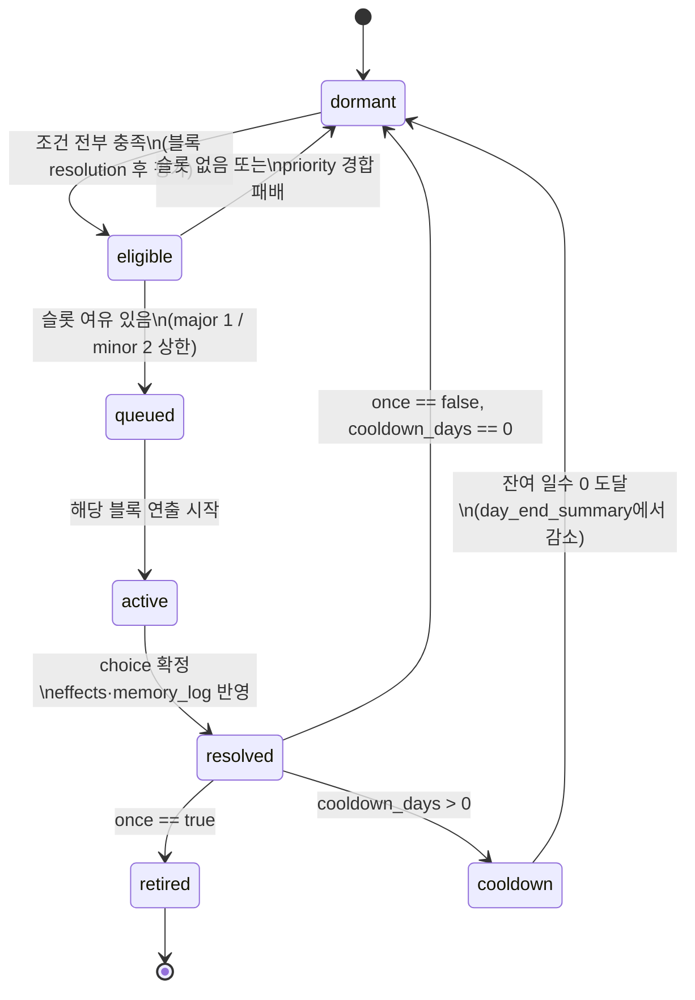

# 07_01 Event System

## Purpose

- 하루 루프(day_start → block_allocation → block_resolution ×5 → day_end_summary → autosave) 위에서
  챕터 감정 목표(01_04)를 전달하는 이벤트의 발생·선정·소비 규칙을 정의한다.
- 트리거는 D-010에 따라 3유형(`scheduled` / `conditional` / `random`)만 존재한다.
- 이벤트는 감정 전달 수단이다. 발생 규칙이 플레이어에게 "파밍" 대상으로 보이면 실패다 (Pillar 1).

## Variables

| 변수 | 타입 | 범위/값 | 정의 |
|---|---|---|---|
| `event_id` | string | `ch{챕터}_ev_{3자리}` | 이벤트 고유 ID (예: `ch1_ev_004`) |
| `chapter` | int | 1~5 | 소속 챕터. 타 챕터에서는 평가 대상 제외 |
| `event_class` | string | `major` \| `minor` | 슬롯 소비 종류. 본 문서에서 신규 도입 |
| `trigger.type` | string | `scheduled` \| `conditional` \| `random` | D-010의 3유형 |
| `trigger.conditions` | array | 조건 객체 배열 | 아래 "조건 스키마" 참조. AND 결합 |
| `priority` | int | 0~100 | 충돌 해소용. 높을수록 우선 |
| `once` | bool | true/false | true면 1회 발생 후 영구 소진 |
| `cooldown_days` | int | 0~ | 재발생 금지 일수. `once:true`면 무시 |
| `weight` | int | 1~100 | `random` 전용 가중치. 생략 시 10 |
| `daily_major_used` | bool | - | 세이브 내 당일 major 슬롯 사용 여부 |
| `daily_minor_used` | int | 0~2 | 당일 minor 슬롯 사용 수 |
| `fired_once_set` | set | event_id 목록 | `once` 소진 이벤트 기록 |
| `cooldown_map` | map | event_id → 남은 일수 | `day_end_summary`에서 1씩 감소 |

조건 스키마 (`trigger.conditions[]`, 모두 AND):

| type | 필드 | 예시 | 의미 |
|---|---|---|---|
| `day_range` | `min`, `max` | `{"type":"day_range","min":45,"max":60}` | 게임 내 일차 창(scheduled의 기본 조건) |
| `stat` | `key`, `op`, `value` | `{"type":"stat","key":"mind","op":"<","value":35}` | 핵심 수치·`rel_*` 비교 (`op`: `<` `<=` `>` `>=` `==`) |
| `memory` | `memory_tag`, `exists` | `{"type":"memory","memory_tag":"mem_ch1_first_smile","exists":true}` | memory_log 보유 여부 |
| `time_block` | `value` | `{"type":"time_block","value":"night"}` | 특정 블록에서만 발생 |
| `season` / `holiday` | `value` | `{"type":"holiday","value":"seollal"}` | 06_01의 계절·명절 식별자 |
| `streak` | `key`, `days` | `{"type":"streak","key":"night_feeding","days":3}` | 행동 연속 일수 (연속 카운터는 03_GAME_SYSTEM) |

## State Machine

이벤트 인스턴스의 생명주기. 큐 평가는 매일 각 `block_resolution` 종료 직후 총 5회 수행한다.



선정 규칙 (eligible → queued):

1. 하루 슬롯 상한: `major` 1개 + `minor` 2개. 초과분은 그날 발생하지 않는다 (이월 없음, 다음 평가에서 재경합).
2. 동일 슬롯 경합 시 `priority` 높은 값 우선.
3. `priority` 동률 시 트리거 유형 순서로 해소: `scheduled` > `conditional` > `random`.
4. 그래도 동률이면 `event_id` 사전순 (결정적 재현성 확보, QA 리플레이용).
5. `random`은 조건 충족 후보 중 `weight` 비례 추첨을 먼저 거친 뒤 위 경합에 참여한다.

## UI

- 이벤트 연출 진입 시 상단 수치 HUD를 페이드아웃한다 (D-004). 복귀는 `resolved` 이후.
- `major` 이벤트는 전체 화면 연출, `minor`는 현재 장소 위 오버레이 연출 (09_UI 상세).
- 선택지에는 수치 변화량을 표기하지 않는다. 효과는 이후 아이·NPC의 행동 변화로만 체감시킨다 (Pillar 1).
- `day_end_summary`에서는 "오늘의 기억" 카드로 당일 `memory_tag`만 나열하고 수치 델타는 요약 화면에서만 노출.

## Database

12_DATABASE 스키마 개요 (상세 DDL은 12_DATABASE에서 확정):

| 테이블 | 키 | 주요 컬럼 | 비고 |
|---|---|---|---|
| `events` (정적) | `event_id` | chapter, event_class, trigger(json), priority, once, cooldown_days, weight | 13_JSON 원본을 빌드 시 적재 |
| `event_state` (세이브) | save_id + `event_id` | status(dormant/retired/cooldown), cooldown_remaining | `fired_once_set`·`cooldown_map`의 영속화 |
| `daily_slot_state` (세이브) | save_id + day | daily_major_used, daily_minor_used | `day_start`에서 리셋 |
| `memory_log` (세이브) | save_id + seq | day, event_id, choice_id, memory_tag, emotion_tags(json) | 캐논 엔트리 구조 그대로 |

## JSON

이벤트 파일 골격 (13_JSON 포맷 기준). `event_class`는 본 문서 도입 필드, `callback_plan`은 07_02 참조.

```json
{
  "event_id": "ch1_ev_001",
  "chapter": 1,
  "title_kr": "조리원 퇴소",
  "event_class": "major",
  "emotion_tags": ["overwhelmed"],
  "trigger": {
    "type": "scheduled",
    "conditions": [{ "type": "day_range", "min": 1, "max": 1 }]
  },
  "priority": 90,
  "scenes": [
    {
      "scene_id": "ch1_ev_001_s1",
      "location_id": "loc_postpartum_center",
      "time_block": "morning",
      "script_kr": ["짐 가방 두 개. 2주 전보다 손이 모자라다."]
    }
  ],
  "choices": [
    {
      "choice_id": "ch1_ev_001_c1",
      "text_kr": "남편에게 카시트 확인을 맡긴다",
      "effects": { "rel_npc_husband": 3, "stamina": -5 },
      "memory_tag": "mem_ch1_leaving_center"
    }
  ],
  "once": true,
  "cooldown_days": 0
}
```

- `memory_log` 기록: choice 확정 시 `{"day":1,"event_id":"ch1_ev_001","choice_id":"ch1_ev_001_c1","memory_tag":"mem_ch1_leaving_center","emotion_tags":["overwhelmed"]}`.
- `memory_tag` 명명: `mem_{챕터}_{주제}` (예: `mem_ch1_first_smile`).

## QA

| TC | 시나리오 | 기대 결과 |
|---|---|---|
| EV-001 | major 2개가 같은 날 eligible | priority 높은 1개만 발생, 나머지는 dormant 복귀 (이월 없음) |
| EV-002 | priority 동률: conditional(50) vs scheduled(50) | scheduled 발생 |
| EV-003 | `once:true` 이벤트 발생 후 조건 재충족 | retired 상태, 영구 미발생. `event_state`에 기록 확인 |
| EV-004 | `cooldown_days:7` 이벤트 발생 후 6일째 조건 충족 | 미발생. 7일 경과(day_end 감소) 후 발생 가능 |
| EV-005 | minor 3개 eligible | 상위 2개만 발생 (minor 상한 2) |
| EV-006 | 블록 3 resolution에서 stat 조건 충족 | 블록 3 평가 시점에 queued — 블록 1~2로 소급되지 않음 |
| EV-007 | `emotion_tags` 빈 배열 이벤트 빌드 | 데이터 검증 단계 리젝 (D-005) |
| EV-008 | 동일 세이브·동일 시드 리플레이 | 발생 이벤트 순서 완전 동일 (선정 규칙 4의 결정성) |
| EV-009 | 감정 장면 진입 | 수치 HUD 비노출 상태 스크린샷 검증 (D-004) |
| EV-010 | 타 챕터 이벤트 조건 충족 | 평가 대상 제외 (chapter 필터) |
