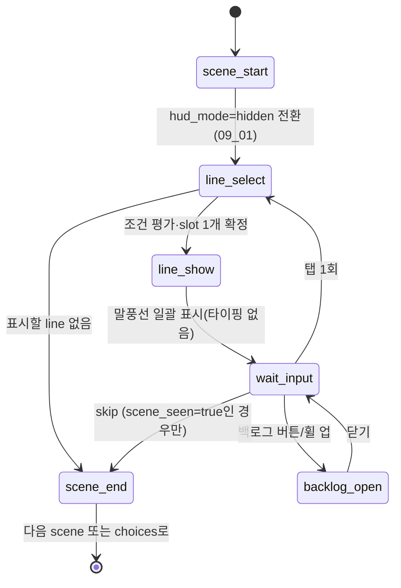

# 08_01 Dialogue System

## Purpose

이벤트(07_EVENT)의 `scenes` 내부에서 재생되는 대사의 데이터 구조·조건 평가·표시 규칙을 단일 기준으로 정의한다. 감정 전달 수단 우선순위(01_04 §2)에서 대사는 3순위다: 아이의 행동 변화와 일상의 변주로 먼저 보여주고, 대사는 짧고 절제된 문장으로만 보탠다. 감정 장면 재생 중 수치 UI는 숨긴다(D-004, 09_01 연동). 문체 규칙은 08_02, 아이의 연령별 발화 규칙은 08_03이 소유하며 본 문서는 구조와 동작만 정의한다.

## Variables

### scene 구조

| 필드 | 타입 | 필수 | 설명 |
|---|---|---|---|
| `scene_id` | string | O | `{event_id}_s{번호}` (예: `ch1_ev_001_s1`) |
| `seq` | int | O | 이벤트 내 재생 순서 (1부터) |
| `location_id` | string | X | 공간 식별자 (06_WORLD 소유) |
| `lines` | array | O | 아래 line 객체의 배열. 빈 배열 금지 |

### line 구조

| 필드 | 타입 | 필수 | 설명 |
|---|---|---|---|
| `line_id` | string | O | `{scene_id}_l{번호}` |
| `speaker` | enum | O | `player` / `child` / `npc_{id}` (예: `npc_husband`, `npc_mother_in_law`) |
| `text_kr` | string | 조건부 | 대사 본문, 40자 이내(08_02). CH1 아이 발화는 `text_kr` 대신 `vocal_tag` 사용(08_03) |
| `vocal_tag` | string | 조건부 | 울음·옹알이 의미 태그(08_03). `text_kr`와 동시 사용 금지 |
| `condition` | array/null | X | 아래 condition 스키마. null 또는 빈 배열이면 무조건 후보 |
| `emotion` | string | O | 챕터 `emotion_tags` 어휘(01_04) + `neutral`. 초상화·연출 큐로 사용 |
| `line_slot` | int | X | 같은 slot을 가진 line 중 조건이 처음 참인 1개만 표시(변형 대사). slot 없으면 항상 후보 |
| `subtext_kr` | string | X | 아이의 숨긴 속마음(08_03, CH4~5). 화면에 표시하지 않는다 |

### condition 스키마 (배열 원소, 배열 전체는 AND)

| `type` | 키 | 연산 | 예시 |
|---|---|---|---|
| `stat` | 핵심 수치 5종(D-003) | `op`: `lt`/`lte`/`gt`/`gte`/`eq` | `{"type":"stat","key":"mind","op":"lt","value":30}` |
| `trait` | 성격 축 4종(D-008) | 동일 | `{"type":"trait","key":"expressiveness","op":"gte","value":70}` |
| `memory` | `memory_tag` | `exists`: true/false | `{"type":"memory","tag":"mem_ch1_night_holding","exists":true}` |
| `chapter` | 챕터 번호 | `eq` | `{"type":"chapter","op":"eq","value":3}` |

### 톤 변형 (line_slot으로 구현)

| 변형 키 | 발동 조건 | 근거 |
|---|---|---|
| `tone_default` | 조건 없는 기본 slot line | — |
| `tone_exhausted` | `mind < 30` (strained 밴드) | 03_01 임계값 표 |
| `tone_hesitant` | `money < 300,000` (지출 관련 대사) | 03_01 임계값 표 |

## State Machine



- 조건 평가 시점: `line_select` 진입 시 1회. 재생 중 수치가 변해도 이미 표시된 line은 바뀌지 않는다.
- 같은 `line_slot`에서 복수 조건이 참이면 배열 등록 순서가 빠른 line이 이긴다. slot마다 조건 없는 기본 line 1개를 반드시 포함한다(폴백 보장).

## UI

- **말풍선**: 짧은 말풍선 1개씩 표시. 타이핑(글자 순차 출력) 연출을 사용하지 않고 문장을 일괄 표시한다. 40자 상한(08_02)이 말풍선 1줄~2줄 크기를 보장한다.
- **진행**: 화면 아무 곳 탭 1회로 다음 line. 원탭 원칙(09_01). 자동 진행 옵션은 두지 않는다(읽는 속도 존중).
- **스킵**: 해당 `scene_id`가 `dialogue_seen`에 기록된 경우에만 스킵 버튼 노출. 스킵해도 선택지 진입·`effects`·`memory_tag` 기록은 동일하게 적용된다. 첫 감상은 스킵 불가.
- **백로그**: 최근 100개 line을 세션 내에서 열람. `speaker`는 한국어 호칭(08_02 호칭 표)으로 표기. 수치·effects·`subtext_kr`는 백로그에 절대 표시하지 않는다(D-004).
- **감정 장면**: scene 재생 중 HUD는 `hidden` 모드(09_01). `emotion` 필드는 초상화 표정·아이 행동 애니메이션 큐로만 소비하고 텍스트로 노출하지 않는다.

## Database

| 테이블 | 키 | 컬럼 | 비고 |
|---|---|---|---|
| `dialogue_scene` | scene_id | event_id, seq, location_id | 12_DATABASE 스키마 소유 |
| `dialogue_line` | line_id | scene_id, seq, line_slot, speaker, text_kr, vocal_tag, condition_json, emotion, subtext_kr | 정적 콘텐츠 |
| `dialogue_seen` | save_id, scene_id | seen_at_day | 스킵 허용 판정용 |
| `dialogue_backlog` | (런타임 전용) | line_id 순환 버퍼 100개 | 저장 데이터에 미포함 |

## JSON

```json
{
  "scene_id": "ch1_ev_001_s1",
  "seq": 1,
  "location_id": "loc_home_living",
  "lines": [
    {"line_id": "ch1_ev_001_s1_l1", "speaker": "child", "vocal_tag": "cry_unknown", "condition": null, "emotion": "overwhelmed"},
    {"line_id": "ch1_ev_001_s1_l2", "speaker": "player", "line_slot": 1, "text_kr": "왜 그래… 배고파? 아까 먹었잖아.", "condition": null, "emotion": "overwhelmed"},
    {"line_id": "ch1_ev_001_s1_l3", "speaker": "player", "line_slot": 1, "text_kr": "…알았어. 엄마 여기 있어.",
     "condition": [{"type": "stat", "key": "mind", "op": "lt", "value": 30}], "emotion": "overwhelmed"},
    {"line_id": "ch1_ev_001_s1_l4", "speaker": "npc_husband", "text_kr": "여보, 내가 안아볼까?",
     "condition": [{"type": "memory", "tag": "mem_ch1_husband_helped", "exists": true}], "emotion": "neutral"}
  ]
}
```

- 조건부 line(`l3`)이 slot 1에서 `l2`보다 뒤에 있으므로, `mind < 30`이어도 등록 순서상 `l2`가 먼저 평가된다 → 우선시킬 변형은 배열 앞쪽에 배치한다.

## QA

| TC | 사전 조건 | 절차 | 기대 결과 |
|---|---|---|---|
| DL-01 | slot 1에 조건 line만 있고 기본 line 없음 | 콘텐츠 린트 실행 | 폴백 누락으로 리젝 |
| DL-02 | `text_kr` 41자 line 등록 | 콘텐츠 린트 실행 | 40자 상한 위반 리젝(08_02) |
| DL-03 | `mind` 28 | scene 재생 | slot 내 `tone_exhausted` 변형 표시 |
| DL-04 | scene 미감상 세이브 | scene 진입 | 스킵 버튼 미노출 |
| DL-05 | `dialogue_seen` 기록된 scene | 스킵 실행 | effects·memory_tag 정상 적용, choices 정상 진입 |
| DL-06 | scene 재생 중 | 화면 캡처 검사 | 수치 UI 요소 0개(D-004), 백로그에 subtext_kr 미표시 |
| DL-07 | `text_kr`와 `vocal_tag` 동시 정의 | 콘텐츠 린트 실행 | 상호 배타 위반 리젝 |
| DL-08 | 재생 중 effects로 mind 32→28 변동 | 동일 scene 내 후속 line 확인 | 조건 재평가 없음(진입 시점 값 유지) |
