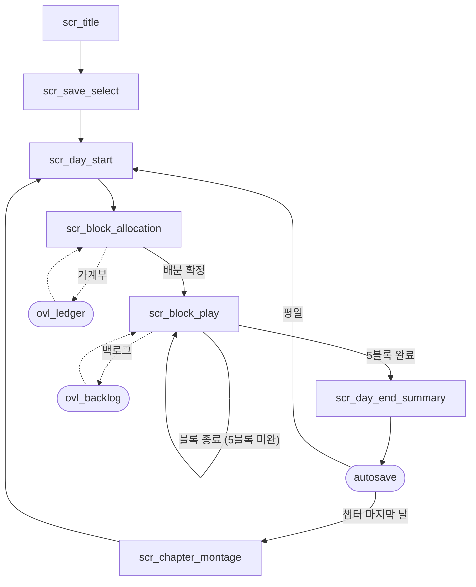

# 09_02 Screen Flow

## Purpose

게임 전체 화면의 식별자·전이·이탈 경로를 단일 기준으로 정의한다. 하루 루프 `day_start → block_allocation → block_resolution ×5 → day_end_summary → autosave`(D-007, 02_GAME_DESIGN)를 화면 단위로 구현하며, 1일 = 1세션(20~40분, D-006)이 끊김 없이 완주되도록 이탈 경로를 최소화한다. HUD 모드 규칙은 09_01, 위젯 명세는 09_03이 소유한다.

## Variables

### 화면(screen) 목록

| `screen_id` | 한국어 | 목적 | 주요 입력 | 이탈 경로 |
|---|---|---|---|---|
| `scr_title` | 타이틀 | 시작·이어하기 진입 | 시작/이어하기/설정 클릭 | `scr_save_select`, `ovl_settings`, 종료 |
| `scr_save_select` | 세이브 선택 | 슬롯 선택·삭제 | 슬롯 클릭 | `scr_day_start`, 뒤로가기 → `scr_title` |
| `scr_day_start` | 하루 시작 | 날짜·계절·아이 상태 연출, 자원 갱신 확인 | 클릭 1회로 진행 | `scr_block_allocation` |
| `scr_block_allocation` | 블록 배분 | 5개 `time_block`에 행동 배분 | 블록 칸·행동 카드 클릭, 확정 버튼 | `scr_block_play`, `ovl_pause` |
| `scr_block_play` | 블록 진행 | `block_resolution` 재생. 이벤트·대화(08_01) 포함 | 대사 진행 클릭, 선택지 클릭 | 다음 블록(자기 자신), `scr_day_end_summary`, `ovl_pause`, 백로그 |
| `scr_day_end_summary` | 하루 마감 | 변화 요약(문장형, 09_03) 표시 | 클릭 1회로 진행 | autosave → `scr_day_start` 또는 `scr_chapter_montage` |
| `scr_chapter_montage` | 챕터 전환 몽타주 | 챕터 감정 목표(01_04) 회수 연출. `memory_log` 회상 | 스킵 불가, 클릭으로 컷 진행 | 다음 챕터 `scr_day_start` |

### 오버레이(overlay) 목록 — 화면 위에 겹침, 흐름을 끊지 않음

| `overlay_id` | 목적 | 호출 가능 화면 | 닫힘 후 복귀 |
|---|---|---|---|
| `ovl_pause` | 일시정지·저장·종료 | 전 화면 (`scr_chapter_montage` 포함) | 호출 원점 |
| `ovl_settings` | 텍스트 크기·음량·색약 옵션(09_01 §5) | `scr_title`, `ovl_pause` 경유 | 호출 원점 |
| `ovl_backlog` | 대사 백로그(08_01) | `scr_block_play` | 호출 원점 |
| `ovl_ledger` | 가계부. `money` 숫자 노출 유일 지점(09_01 §2) | `scr_block_allocation` | 호출 원점 |

## State Machine



- `scr_block_play` 내부: 블록 시작 → 이벤트 트리거 판정(D-010) → (이벤트 있으면) scenes 재생(08_01) → choices → 블록 정산 → 다음 블록. 세부 상태는 08_01 State Machine을 따른다.
- autosave는 화면이 아닌 `scr_day_end_summary` 종료 시점의 무화면 처리 단계다. 저장 중 입력은 잠그고 저장 아이콘 1개만 표시한다.
- `scr_chapter_montage`는 첫 감상 스킵 불가(챕터 감정 목표의 회수 지점). 2회차 세이브에서는 스킵 허용.

## UI

- 화면 전환은 전부 0.5초 크로스페이드. 로딩 스피너·검은 컷 전환 금지(일상의 연속감 유지).
- `hud_mode`(09_01 §3): `scr_day_start`·`scr_block_allocation` = `full`, `scr_block_play` 평시 = `minimal`, scenes 재생·`scr_chapter_montage` = `hidden`.
- 뒤로가기: `scr_save_select` 외의 본편 화면에는 뒤로가기 버튼을 두지 않는다. 하루는 앞으로만 흐른다(복구는 09_01 §4.2 규칙으로만).
- 모든 화면은 마우스 클릭만으로 완주 가능(09_01 §4.1).

## Database

| 테이블 | 키 | 컬럼 | 비고 |
|---|---|---|---|
| `screen_def` | screen_id | name_kr, hud_mode, transition_ms | 화면 상수 (12_DATABASE) |
| `session_flow_log` | save_id, day, seq | screen_id, entered_at, left_at | 세션 길이(D-006 20~40분) 검증용 |
| `save_slot` | slot_id | save_id, day, chapter, thumbnail_ref, saved_at | `scr_save_select` 표시 원천 |

## JSON

```json
{
  "screen_flow": {
    "day_loop": ["scr_day_start", "scr_block_allocation", {"repeat": "scr_block_play", "count": 5}, "scr_day_end_summary", "autosave"],
    "chapter_end_insert": {"after": "autosave", "screen": "scr_chapter_montage", "condition": "is_chapter_last_day"},
    "transitions": {"type": "crossfade", "duration_ms": 500},
    "overlays": {
      "ovl_ledger": {"parents": ["scr_block_allocation"]},
      "ovl_backlog": {"parents": ["scr_block_play"]},
      "ovl_pause": {"parents": ["*"]}
    }
  }
}
```

## QA

| TC | 사전 조건 | 절차 | 기대 결과 |
|---|---|---|---|
| SF-01 | 새 세이브 | 하루 완주 | 화면 순서가 day_loop 정의와 일치, 블록 5회 반복 확인 |
| SF-02 | 챕터 마지막 날 | day_end_summary 종료 | autosave 후 `scr_chapter_montage` 진입, 이후 다음 챕터 `scr_day_start` |
| SF-03 | 챕터 마지막 날 아닌 날 | 동일 | montage 미진입, 바로 다음 `scr_day_start` |
| SF-04 | `scr_block_play` 진행 중 | 강제 종료 후 이어하기 | 최근 autosave(전일 마감) 지점에서 재개, 데이터 손실 없음 |
| SF-05 | `ovl_ledger` 열림 | 화면 캡처 검사 | money 원화 숫자 노출은 이 오버레이가 유일(다른 전 화면 0건) |
| SF-06 | 본편 화면 전체 | UI 요소 검사 | 뒤로가기 버튼 0개, 마우스 클릭만으로 하루 완주 가능 |
| SF-07 | scenes 재생 중 | `ovl_pause` 호출 | 일시정지 정상 동작, 닫으면 동일 line에서 재개 |
| SF-08 | 1회차 세이브 | montage에서 스킵 시도 | 스킵 UI 미노출. 2회차 세이브에서는 노출 |
