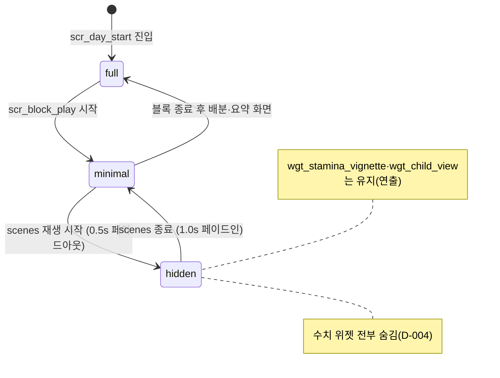

# 09_03 HUD and Widgets

## Purpose

HUD·위젯의 전체 카탈로그를 정의한다. 모든 위젯은 09_01의 원칙(숫자보다 상태, D-004)을 따르며, 수치를 직접 표기하는 위젯은 가계부(`ovl_ledger` 내 `wgt_money_ledger`)가 유일하다. 각 위젯의 노출 여부는 `hud_mode`(09_01 §3)와 화면(09_02)이 결정한다. 임계 밴드 값(secure/distant, mind 밴드 등)은 03_01 임계값 표를 참조하며 재정의하지 않는다.

## Variables

### 위젯 카탈로그

| `widget_id` | 표현 대상 | 표현 방식 (간접) | 노출 조건 | 숨김 조건 |
|---|---|---|---|---|
| `wgt_portrait_player` | `mind` 밴드 | 엄마 초상화 표정 3단계: `bright`(stable) / `weary`(strained) / `blank`(depleted) | `hud_mode` full·minimal | `hidden` |
| `wgt_stamina_vignette` | `stamina` | 화면 가장자리 톤 다운 3단계(≥50 없음 / 20~49 약함 / <20 강함) | 상시 — 연출이므로 `hidden`에서도 유지 | 타이틀·세이브 화면 |
| `wgt_child_view` | `child_condition` + `attachment` | 행동 애니메이션: attachment 밴드로 세트 선택(`secure`/`neutral`/`distant`), condition으로 생기·처짐 변조 | 아이가 화면에 있는 모든 장면 | 없음 (수치 UI가 아닌 연출) |
| `wgt_money_icon` | `money` 상태 | HUD 가계부 아이콘. `money < 300,000`이면 낡은 상태 아이콘으로 교체 | `hud_mode` full | minimal·hidden |
| `wgt_money_ledger` | `money` 숫자 | 원화 콤마 표기 + 최근 지출 내역. **숫자 노출 유일 지점** | `ovl_ledger` 내부만 | 그 외 전부 |
| `wgt_time_block_bar` | 하루 진행 | 5칸 블록 바(morning~night), 현재 블록 강조. 숫자·시각 표기 없음 | full·minimal | hidden |
| `wgt_block_cards` | 행동 배분 | 행동 카드(돌봄/가사/일/자기 돌봄). effects 수치 미표기, 문장 설명만 | `scr_block_allocation` | 그 외 |
| `wgt_summary_sheet` | 하루 변화 요약 | 문장형 요약(아래 규칙) | `scr_day_end_summary` | 그 외 |
| `wgt_backlog_button` | 백로그 진입 | 화면 우상단 소형 버튼(08_01) | `scr_block_play` | 그 외 |
| `wgt_save_indicator` | autosave 진행 | 저장 아이콘 1개, 완료 시 소멸 | autosave 단계 | 그 외 |

### `wgt_summary_sheet` — 문장형 요약 규칙

수치 델타를 표기하지 않는다. 핵심 수치 5종은 방향 화살표(▲/▼/―)만 허용하고 변화량 숫자는 금지한다(03_01 UI 절과 정합). 성격 축·기억은 문장으로만 쓴다.

| 대상 | 표기 | 예시 |
|---|---|---|
| 핵심 수치 5종 | 아이콘 + 방향(▲▼―)만. 숫자 델타 금지 | 마음 아이콘 ▼ |
| 성격 축 4종 | 숫자·화살표 전면 금지. 당일 선택에서 파생된 관찰 문장 1개 | "아이가 오늘 낯선 사람에게 먼저 인사했다" |
| `memory_log` 신규 기록 | 문장 1줄 + 손글씨 폰트(09_01 §5) | "처음으로 밤에 통잠을 잤다" |
| 문장 생성 | `summary_rule` 테이블에서 당일 `stat_delta_log`·memory 기반 우선순위 선택, 최대 3문장 | — |

## State Machine



- 위젯 개별 on/off가 아니라 `hud_mode` 전이에 위젯이 구독하는 구조. 각 위젯은 카탈로그의 노출/숨김 조건만 선언한다.
- 표정·비네트의 밴드 전이는 03_01의 히스테리시스(+5)를 그대로 따르므로 화면상 깜빡임이 없다.

## UI

- 위젯은 화면 가장자리로 밀어 배치하고, 중앙은 항상 아이·공간 연출에 양보한다.
- `wgt_portrait_player` 표정 전환은 즉시 교체가 아니라 0.8초 모션 블렌드(상태 변화를 통보가 아닌 관찰로 만들기).
- `wgt_stamina_vignette`는 `hidden` 모드에서도 유지된다 — 수치 표기가 아니라 화면 톤 연출이므로 D-004 위반이 아니다. 단 3단계 외의 세밀한 단계 표현(연속 게이지화) 금지.
- 모든 위젯 텍스트는 09_01 §5 기준(최소 20px, 대비 4.5:1, 텍스트 크기 옵션 반영)을 따른다.

## Database

| 테이블 | 키 | 컬럼 | 비고 |
|---|---|---|---|
| `widget_def` | widget_id | name_kr, bind_stat, expose_modes, hide_screens | 카탈로그의 데이터화 (12_DATABASE) |
| `summary_rule` | rule_id | source(`stat_delta`/`memory`/`trait_shift`), condition_json, text_template_kr, priority | 문장형 요약 생성 규칙 |
| `summary_log` | save_id, day, seq | rule_id, rendered_text_kr | 회차 리뷰·QA 리플레이용 |

## JSON

```json
{
  "widget_id": "wgt_portrait_player",
  "bind_stat": "mind",
  "states": [
    {"key": "bright", "band": "stable"},
    {"key": "weary", "band": "strained"},
    {"key": "blank", "band": "depleted"}
  ],
  "expose_modes": ["full", "minimal"],
  "transition": {"type": "motion_blend", "duration_ms": 800}
}
```

```json
{
  "rule_id": "sum_trait_confidence_up",
  "source": "trait_shift",
  "condition_json": [{"type": "trait_delta", "key": "confidence", "op": "gt", "value": 0}],
  "text_template_kr": "{child_name}(이)가 오늘은 혼자 해 보겠다고 했다",
  "priority": 40
}
```

## QA

| TC | 사전 조건 | 절차 | 기대 결과 |
|---|---|---|---|
| HW-01 | mind 28 (strained) | 배분 화면 확인 | 초상화 `weary`, 숫자·게이지 라벨 0개 |
| HW-02 | scenes 재생 진입 | 화면 캡처 검사 | 수치 위젯 0개, `wgt_stamina_vignette`·`wgt_child_view`만 잔존 |
| HW-03 | stamina 19 | 전 화면 순회 | 비네트 강함 단계, 어떤 화면에도 stamina 숫자 없음 |
| HW-04 | money 250,000 | HUD·가계부 확인 | HUD는 낡은 아이콘만, 숫자는 `ovl_ledger`에서만 노출 |
| HW-05 | 당일 confidence +2 누적 | day_end_summary 확인 | 성격 축 숫자·화살표 없음, 관찰 문장 1개 출력 |
| HW-06 | 당일 attachment −2 | day_end_summary 확인 | 애착 아이콘 ▼만 표시, "−2" 등 델타 숫자 0건 |
| HW-07 | mind 33↔36 반복 변동 | 초상화 관찰 | 히스테리시스로 표정 깜빡임 없음 |
| HW-08 | summary_rule 후보 5건 | day_end_summary 확인 | priority 상위 최대 3문장만 표시 |
