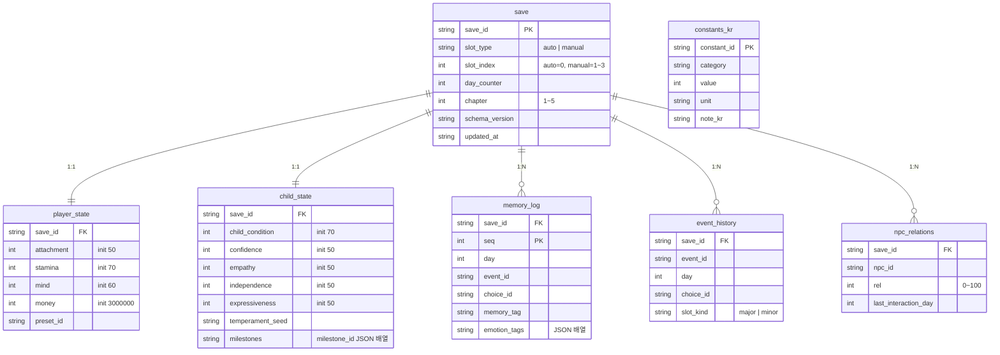

# 12_01 Schema Overview

저장 데이터(세이브)와 정적 데이터(JSON)의 전체 구조를 정의하는 최상위 스키마 문서. 저장 데이터의 구성 단위는 D-002·D-009와 00_01의 핵심 루프를 따르며, 세이브 슬롯은 자동 1개 + 수동 3개다. 개별 테이블의 필드 상세는 12_02, 파일 포맷 규약은 13_JSON이 소유한다.

## 1. 전체 ER 다이어그램

`constants_kr`는 세이브와 관계선이 없는 정적 테이블이다(아래 3절 경계 정의 참조).

## 2. 테이블별 책임 (1줄 요약)

| 테이블 | 구분 | 책임 |
|---|---|---|
| `save` | 동적 | 세이브 슬롯의 루트 레코드. `day_counter`·`chapter`·버전 관리의 단일 기준 |
| `player_state` | 동적 | 엄마의 핵심 수치 4종(attachment, stamina, mind, money)과 배경 프리셋 |
| `child_state` | 동적 | 아이의 컨디션·성격 축 4종·기질 시드·발달 마일스톤 달성 목록 |
| `memory_log` | 동적 | 주요 선택의 영구 기록. 후반 이벤트 회수와 엔딩 연출의 원천(Pillar 4) |
| `event_history` | 동적 | 발생한 이벤트와 선택의 이력. `once`·`cooldown_days` 판정의 근거 |
| `npc_relations` | 동적 | NPC별 관계 수치 `rel`(0~100). 대사 톤·개입 규칙(14_02)의 입력 |
| `constants_kr` | 정적 | 한국 물가·제도 상수(Pillar 3). 밸런싱 근사값의 단일 저장소 |

## 3. 정적 데이터와 동적 데이터의 경계

### 3.1 정적 데이터 (읽기 전용 JSON, 빌드에 포함)

- 위치·포맷: `data/` 이하 JSON 파일(13_01). 런타임에 절대 수정하지 않는다.
- 대상: 이벤트 정의(`data/events/`), 대사 씬(`data/dialogues/`), 상수(`data/constants/constants_kr.json`), 프리셋(`preset_worker`, `preset_freelancer`, `preset_fulltime`), AI 행동 정의(14_01·14_02).
- 식별자 참조 방향: 동적 데이터는 정적 데이터의 id(`event_id`, `choice_id`, `constant_id` 등)를 **문자열로만** 참조한다. 정적 데이터는 동적 데이터를 참조하지 않는다.

### 3.2 동적 데이터 (세이브 파일)

- 구성: `player_state`, `child_state`, `memory_log`, `event_history`, `day_counter`(= `save` 루트 소유). 이 5개 구성 요소가 세이브의 캐논이며, `npc_relations`는 `save` 루트에 귀속되는 확장 구성 요소다.
- 기록 시점: 핵심 루프의 `autosave` 단계(day_end_summary 직후)에 자동 슬롯 1개를 덮어쓴다. 수동 슬롯 3개는 `block_allocation` 화면에서만 저장 가능(감정 장면 중 저장 금지, D-004 연동).
- 파생값 금지: 임계 밴드(03_01의 stable/strained 등), 대사 톤 단계(14_02) 등 수치에서 계산 가능한 값은 저장하지 않고 로드 시 재계산한다.

### 3.3 경계 규칙

1. 정적 JSON의 수치(가격, 가중치, 임계값)를 코드에 하드코딩하는 것을 금지한다. 반드시 `constants_kr` 또는 해당 정의 파일을 경유한다.
2. `schema_version`이 다른 세이브 로드 시 마이그레이션 테이블(12_02의 필드 초기값)로 결측 필드를 채운다. 다운그레이드 로드는 거부한다.
3. 신규 테이블·필드 추가는 DECISION_LOG 승인 후 본 문서의 ER 다이어그램에 먼저 반영한다(00_04 표기 규칙 상속).

## 4. 관련 문서

- 필드 상세: 12_02_tables.md
- 파일 배치·명명: 13_01_json_conventions.md
- 스탯 변화 규칙: 03_01_stat_system.md (본 문서는 저장 구조만 소유)
