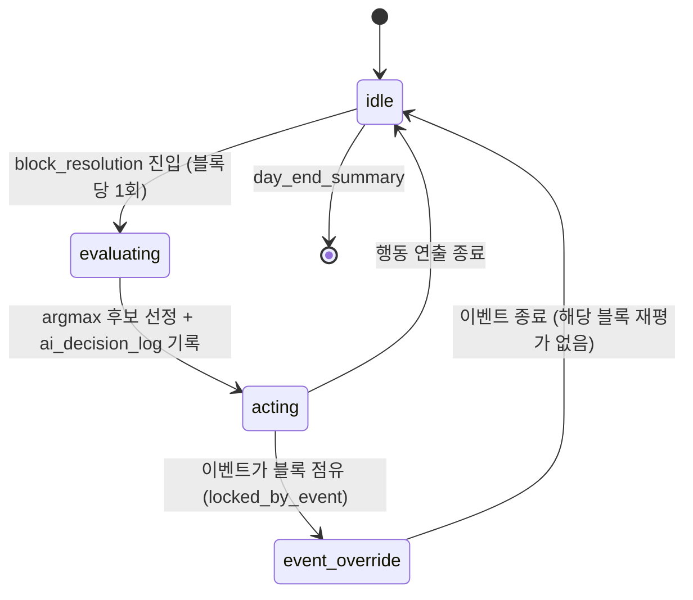

# 14_01 Child Behavior AI

## Purpose

이벤트(07)나 플레이어 선택이 점유하지 않는 시간에 아이가 스스로 보이는 자율 행동을 결정한다. 목적은 수치의 간접 표현이다(Pillar 1, D-004): attachment·성격 축·기질은 숫자가 아니라 "아이가 오늘 무엇을 하는가"로 플레이어에게 전달된다. 행동은 유틸리티 기반 점수로 선정하며, 블록당 1회만 갱신해 연출이 소란스러워지는 것을 막는다. 게임오버 유발 행동은 존재하지 않는다(D-002).

## Variables

행동 후보 `b`의 점수:

```
score(b) = base_weight(b, chapter)
         + Σ stat_mod(b)      // per_point × (stat − pivot), 후보별 정의
         + Σ trait_mod(b)     // per_point × trait 값 (성격 축 4종)
         + temper_mod(b, temperament_seed)
         + ε                  // 블록마다 0~5 균등 난수 (같은 행동 반복 방지)
```

- 각 항은 소수 유지, 최종 비교만 수행. 음수 점수 후보는 선정 대상에서 제외.
- 선정: `score` 최댓값 1개(argmax). 동점이면 `behavior_def` 등록 순서가 빠른 쪽.

| 변수 | 범위 | 소유 | 설명 |
|---|---|---|---|
| `base_weight` | 0~50 | `child_behaviors.json` | 챕터별 기저 가중치. 챕터 미포함 행동은 후보 제외 |
| `stat_mod.per_point` | −1.0~1.0 | 〃 | 수치 보정 기울기. `pivot` 기준 편차에 곱함 |
| `trait_mod.per_point` | 0~0.5 | 〃 | 성격 축 보정. 축 값(0~100)에 곱함 |
| `temper_mod` | −10~+10 | 〃 | 기질 시드(sensitive/easygoing/active)별 고정 보정 |
| `ε` | 0~5 | 런타임 | 블록 시드 난수(리플레이 재현을 위해 save_id+day+block로 시드 고정) |

### 연령대별 행동 풀

| 챕터 | 행동 후보 (`behavior_id`) |
|---|---|
| CH1 (0~12개월) | `bhv_cry`, `bhv_sleep`, `bhv_feed_demand`, `bhv_babble`, `bhv_smile_at_mother` |
| CH2 (1~3세) | `bhv_cry`, `bhv_toddle`, `bhv_tantrum`, `bhv_solo_play`, `bhv_seek_mother`, `bhv_mimic` |
| CH3 (3~5세) | `bhv_solo_play`, `bhv_pretend_play`, `bhv_ask_why`, `bhv_approach_peer`, `bhv_show_drawing` |
| CH4 (5~6세) | `bhv_solo_play`, `bhv_sulk`, `bhv_help_chores`, `bhv_express_feeling`, `bhv_hide_feeling` |
| CH5 (6~7세) | `bhv_read_alone`, `bhv_prep_school_bag`, `bhv_ask_about_school`, `bhv_cling_before_bed`, `bhv_help_chores` |

대표 보정식(전체 값은 `child_behaviors.json`이 소유):

| behavior_id | stat_mod | trait_mod / temper_mod |
|---|---|---|
| `bhv_cry` | `-0.6 × (child_condition − 70)` | sensitive +8, easygoing −3 |
| `bhv_seek_mother` | `+0.3 × (attachment − 50)` | independence `−0.1 × 값`, sensitive +4 |
| `bhv_solo_play` | — | independence `+0.2 × 값`, easygoing +5 |
| `bhv_express_feeling` | — | expressiveness `+0.2 × 값` |
| `bhv_approach_peer` | — | confidence `+0.1`, empathy `+0.1`, active +5 |
| `bhv_hide_feeling` | `-0.2 × (attachment − 50)` | expressiveness `−0.15 × 값` |

## State Machine



- 평가 시점: 각 `block_resolution` 내부 순서(02_01 §2.3)에서 **행동 실행(2단계) 직후, on_block_end 판정(3단계) 이전**. 아이 행동이 conditional 트리거의 입력이 될 수 있게 한다.
- `event_override`: major/minor 이벤트가 재생 중이면 해당 블록의 자율 행동은 생략(재평가 금지 — 블록당 1회 원칙).

## UI

- 행동은 애니메이션·짧은 상황 텍스트로만 표현한다. 점수·후보 목록·수치는 절대 노출하지 않는다(D-004).
- 같은 행동이라도 attachment 밴드에 따라 연출 세트를 교체한다(03_01 임계값 표: `distant`/`secure`).
- `day_end_summary`의 문장형 코멘트(03_01 UI)는 당일 `ai_decision_log`에서 가장 점수가 높았던 행동 1개를 소재로 자동 선택한다.
- 디버그 빌드 한정: F9 오버레이로 후보별 점수 표시(출시 빌드 제거, 15_QA 검증 항목).

## Database

| 테이블 | 구분 | 키 | 컬럼 | 비고 |
|---|---|---|---|---|
| `child_behavior_def` | 정적 | behavior_id | chapters, base_weight, stat_mods, trait_mods, temperament_mods, anim_id | `data/ai/child_behaviors.json` 로드 |
| `ai_decision_log` | 동적 | save_id, day, time_block | chosen_behavior_id, candidates(JSON: id·score 쌍), seed | QA 리플레이·밸런싱 전용. 세이브 파일에는 미포함(최근 7일만 로컬 보관) |

## JSON

`data/ai/child_behaviors.json` 발췌 (13_01 규약 준수):

```json
{
  "schema_version": "1.0",
  "behaviors": [
    {
      "behavior_id": "bhv_cry",
      "chapters": [1, 2],
      "base_weight": 20,
      "stat_mods": [{ "stat": "child_condition", "pivot": 70, "per_point": -0.6 }],
      "trait_mods": [],
      "temperament_mods": { "sensitive": 8, "easygoing": -3, "active": 0 },
      "anim_id": "child_cry_01"
    },
    {
      "behavior_id": "bhv_solo_play",
      "chapters": [2, 3, 4],
      "base_weight": 15,
      "stat_mods": [],
      "trait_mods": [{ "trait": "independence", "per_point": 0.2 }],
      "temperament_mods": { "sensitive": 0, "easygoing": 5, "active": 2 },
      "anim_id": "child_solo_play_01"
    }
  ]
}
```

## QA

| TC | 사전 조건 | 절차 | 기대 결과 |
|---|---|---|---|
| AI-01 | CH1, child_condition 50, seed sensitive | morning 블록 해소 | `bhv_cry` 점수 = 20 + (−0.6×(50−70)) + 8 + ε = 40+ε 로 최상위 선정 |
| AI-02 | CH3, independence 80 | 하루 5블록 해소 | `bhv_solo_play` 선정 빈도가 independence 50 대비 유의미하게 증가 |
| AI-03 | 동일 save_id·day·block 로드 반복 | 블록 재해소 | ε 시드 고정으로 동일 행동 재현 (리플레이 일치) |
| AI-04 | major 이벤트가 블록 점유 | 블록 해소 | 자율 행동 미발생, `ai_decision_log`에 해당 블록 기록 없음 |
| AI-05 | CH1 세이브 | 후보 목록 검사 | `bhv_pretend_play` 등 타 챕터 행동이 후보에 미포함 |
| AI-06 | 모든 후보 점수 음수 | 블록 해소 | 행동 생략(idle 연출), 로그에 `chosen_behavior_id: null` 기록 |
| AI-07 | 출시 빌드 | F9 입력 | 디버그 오버레이 미표시 (D-004) |
| AI-08 | attachment 25 | `bhv_seek_mother` 연출 재생 | `distant` 연출 세트 사용 (03_01 임계값 연동) |
