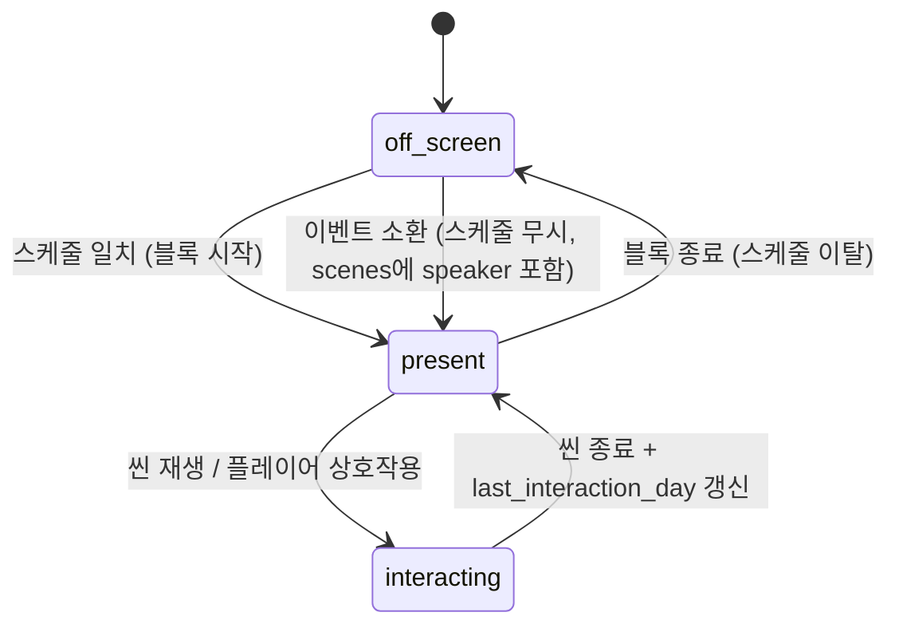

# 14_02 NPC AI

## Purpose

NPC의 등장 시점과 반응 톤을 결정하는 경량 규칙 명세. NPC는 자율 계획을 세우지 않는다 — 요일·블록 기반 스케줄로 등장하고, 관계 수치 `rel`(0~100, `npc_relations` 테이블 12_02 §6)에 따라 대사 톤과 이벤트 개입 확률만 달라진다. 목적은 "관계는 수치가 아니라 태도로 돌아온다"는 감정 전달(Pillar 1)과 한국 육아의 관계 현실(남편 분담, 친정 찬스, 조리원 동기) 재현(Pillar 3)이다.

## Variables

### NPC 명부와 초기 관계

| npc_id | 한국어 | rel init | 비고 |
|---|---|---|---|
| `npc_husband` | 남편 | 60 | 전 챕터 등장 |
| `npc_grandma` | 친정엄마 | 70 | 전 챕터 등장 |
| `npc_daycare_teacher` | 어린이집 교사 | 50 | CH2 입소 이벤트 이후 등장 |
| `npc_cohort_sunny` | 조리원 동기 | 50 | CH1 후반부터 등장 |

- 요일: `weekday = (day_counter − 1) % 7`, day 1 = 월요일. `day_type`(weekday/weekend)은 02_01 정의를 따른다.
- `rel` 변화: 이벤트 선택지 `effects.rel`(13_02, 1회 −10~+10)로만 증감. 방치 감쇠: `day_counter − last_interaction_day ≥ 7`이면 day_end_summary에서 −1.

### 스케줄 (등장 표)

| npc_id | 월~금 | 토·일 |
|---|---|---|
| `npc_husband` | morning, evening, night | 전 블록 |
| `npc_grandma` | 수: midday, afternoon | 토: midday, afternoon |
| `npc_daycare_teacher` | morning(등원), afternoon(하원) | 없음 |
| `npc_cohort_sunny` | 화·금: midday | 없음 |

### 대사 톤 3단계

| rel 구간 | tone_id | 연출 기준 |
|---|---|---|
| 0~29 | `tone_distant` | 짧은 단답, 시선 회피. 먼저 돕겠다는 제안 없음 |
| 30~69 | `tone_neutral` | 일상적 대화. 요청하면 돕는다 |
| 70~100 | `tone_warm` | 먼저 제안·먼저 안부. 13_03 예시의 `rel gte 70` 라인 활성 |

톤 판정은 씬 재생 직전 1회(13_03 §1 평가 시점과 동일). 저장하지 않고 항상 재계산한다(12_01 §3.2 파생값 금지).

### 이벤트 개입 규칙

| 규칙 id | 조건 | 효과 |
|---|---|---|
| `iv_husband_night_share` | `rel npc_husband < 40` | 야간 수유 분담 random 이벤트 `weight` ×0.5 / `rel ≥ 70`이면 ×1.5 |
| `iv_grandma_emergency` | `rel npc_grandma ≥ 60` | 긴급 돌봄(엄마 병가) conditional 이벤트에서 "친정에 맡긴다" 선택지 해금 |
| `iv_teacher_report` | `rel npc_daycare_teacher ≥ 50` | 하원 시 아이 관찰 코멘트 라인 추가(성격 축의 간접 노출) |
| `iv_cohort_compare` | `rel npc_cohort_sunny ≥ 40` | CH3 비교 불안(`comparison`) random 이벤트 후보 활성 |

배율은 13_02의 `trigger.weight`에 곱한 뒤 정수 내림하며, 결과 0이면 후보 제외.

## State Machine



- 이벤트 소환이 스케줄보다 항상 우선한다(연출 정합성). 소환 등장도 `last_interaction_day`를 갱신한다.

## UI

- `rel` 수치는 어떤 화면에도 노출하지 않는다(D-004 확장). 관계는 톤·행동(먼저 돕기, 시선 회피)으로만 표현한다.
- 블록 배분 화면에서 해당 블록에 등장 예정인 NPC를 실루엣 아이콘으로만 예고한다(계획 수립 보조, 09_UI).
- 톤 전이(예: neutral→warm) 직후 첫 등장에서는 전용 소규모 연출 라인을 우선 재생한다(변화의 체감, Pillar 4).

## Database

| 테이블 | 구분 | 키 | 컬럼 | 비고 |
|---|---|---|---|---|
| `npc_schedule_def` | 정적 | npc_id | weekdays(0~6 배열), time_blocks, active_from_chapter | `data/ai/npc_schedules.json` 로드 |
| `npc_intervention_def` | 정적 | rule_id | npc_id, condition(13_03 문법), effect_type, effect_value | 개입 규칙 표의 데이터화 |
| `npc_relations` | 동적 | save_id, npc_id | rel, last_interaction_day | 12_02 §6 소유. 본 문서는 참조만 |

## JSON

`data/ai/npc_schedules.json` 발췌:

```json
{
  "schema_version": "1.0",
  "npcs": [
    {
      "npc_id": "npc_husband",
      "active_from_chapter": 1,
      "rel_init": 60,
      "schedule": [
        { "weekdays": [0, 1, 2, 3, 4], "time_blocks": ["morning", "evening", "night"] },
        { "weekdays": [5, 6], "time_blocks": ["morning", "midday", "afternoon", "evening", "night"] }
      ]
    }
  ],
  "interventions": [
    {
      "rule_id": "iv_husband_night_share",
      "npc_id": "npc_husband",
      "condition": { "rel": "npc_husband", "op": "lt", "value": 40 },
      "effect_type": "random_weight_multiplier",
      "effect_value": 0.5,
      "target_event_id": "ch1_ev_021"
    }
  ]
}
```

## QA

| TC | 사전 조건 | 절차 | 기대 결과 |
|---|---|---|---|
| NPC-01 | day 3(수요일) midday | 블록 시작 | `npc_grandma` 등장, 화요일에는 미등장 |
| NPC-02 | rel npc_husband 29 | 남편 씬 재생 | `tone_distant` 라인 세트 선택 |
| NPC-03 | rel npc_husband 39, `ch1_ev_021` weight 40 | random 추첨 | 유효 weight 20 (×0.5 내림) |
| NPC-04 | rel npc_grandma 55 | 긴급 돌봄 이벤트 발생 | "친정에 맡긴다" 선택지 잠금 상태 |
| NPC-05 | last_interaction_day 격차 7일 | day_end_summary | 해당 NPC rel −1, 6일이면 변화 없음 |
| NPC-06 | CH1 세이브 | 전 블록 순회 | `npc_daycare_teacher` 미등장 (active_from_chapter 2) |
| NPC-07 | 임의 화면 | UI 검사 | rel 수치 표시 요소 0개 |
| NPC-08 | rel 69→70 상승 직후 첫 등장 | 씬 재생 | 톤 전이 전용 라인 우선 재생 후 `tone_warm` 적용 |
